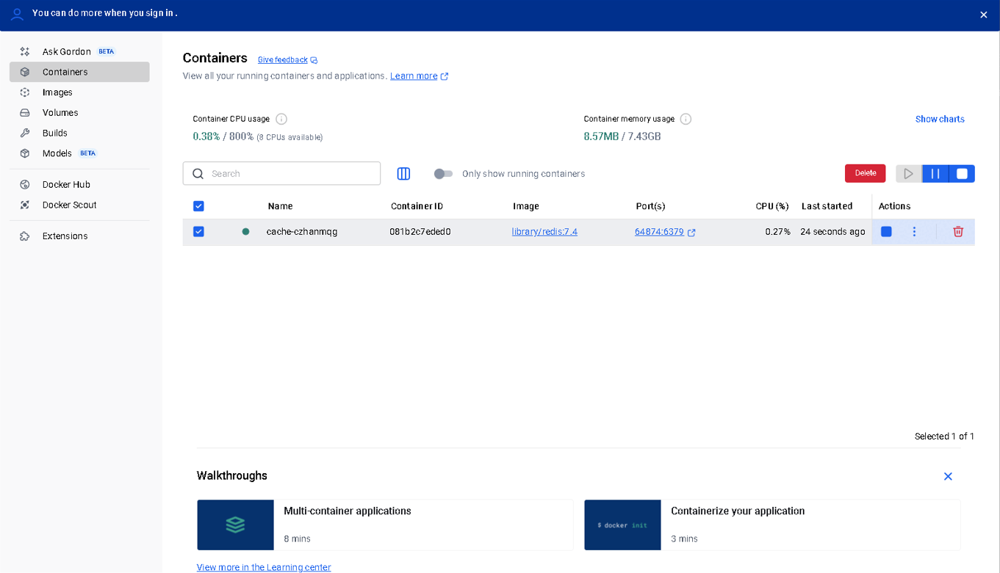
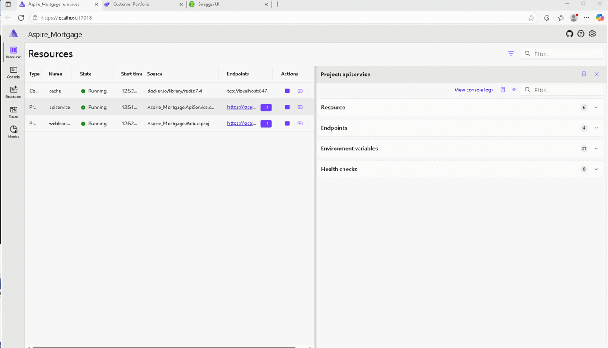


# .NET Aspire

.NET Aspire is a cloud-native application framework designed to simplify the development of observable, production-ready distributed applications in .NET. It provides tools, templates, and integrations to streamline the setup of multi-service applications, making it easier to manage dependencies like databases, messaging, and caching.

## Key Features of .NET Aspire
✔ Dev-Time Orchestration – Helps developers run and connect multi-project applications efficiently.
✔ Service Discovery & Configuration Management – Automates connection strings and network configurations.
✔ Cloud-Native Integrations – Supports Redis, PostgreSQL, and other services via standardized interfaces.
✔ Tooling Support – Works with Visual Studio, VS Code, and .NET CLI for seamless development.

## How It Works
.NET Aspire simplifies the local development experience by handling service discovery, environment variables, and container configurations, ensuring a consistent bootstrapping process across different machines

### Apps

- Docker Containers
   

- Metrics
   

- MS SQL
   

- Resources
   

- SaaS Customer Portfolio Report
   

- Swagger-Aspire Mortgage API
   

- Traces
   

Aspire .NET PWA SaaS provides a cloud-native solution for modern web applications, integrating: ✔ ASP.NET API – RESTful services for data-driven operations. ✔ Docker – Containerized deployments ensuring scalable environments. ✔ Redis – High-speed caching layer for optimized responses. ✔ Microsoft SQL Server – Secure transactional database management. ✔ API Gateway – Seamless integration across services.

2. Features
✔ Multi-Tenant SaaS Support – Isolated data architecture for multiple users. ✔ Offline-First PWA – Service workers for caching & background sync. ✔ API-Driven Architecture – REST & GraphQL endpoints. ✔ Containerized Scalability – Docker + Kubernetes for optimized performance. ✔ Redis Caching – Low-latency response optimization. ✔ Secure Authentication – OAuth2.0, JWT, and Role-Based Access Control (RBAC). ✔ CI/CD Ready – Automated pipelines with Azure DevOps or GitHub Actions.

1. Introduction
1.1 Purpose
This PRD defines the requirements for building an Aspire .NET Progressive Web Application (PWA) SaaS solution, leveraging ASP.NET API, Docker containers, Redis caching, Microsoft SQL Server, and scalable API architecture. The objective is to create a high-performance, cloud-native SaaS platform optimized for multi-tenant applications, real-time data processing, and API-driven integrations.

1.2 Scope
✔ Multi-Tenant SaaS Architecture – Secure data isolation for different tenants using containerized deployments and scalable API layers. ✔ PWA Features – Offline support, background syncing, and fast response times. ✔ Cloud-Native & API-Driven – Fully containerized Docker-based infrastructure for streamlined deployment and management. ✔ High Availability & Performance Optimization – Caching using Redis, database scalability with MS SQL, and API orchestration.

2. Functional Requirements
2.1 Authentication & Security
✔ Implement OAuth2.0 & JWT-based authentication for secure API access. ✔ Multi-tenant role-based access control (RBAC) to segregate data between different customers. ✔ API rate-limiting & request validation to prevent abuse.

2.2 Data Processing & Storage
✔ Microsoft SQL Server as the primary database with sharding & partitioning for scalability. ✔ Redis caching for low-latency API responses. ✔ Event-driven architecture using message queues (RabbitMQ or Azure Service Bus) for real-time workflows.

2.3 API Design & Integration
✔ RESTful API endpoints with ASP.NET Core API and GraphQL support for optimized data retrieval. ✔ API Gateway for request routing, security enforcement, and throttling. ✔ Webhooks for real-time third-party integrations.

2.4 PWA Capabilities
✔ Offline-first functionality with Service Workers and indexed DB caching. ✔ Background sync to keep data updated when reconnected. ✔ Push notifications using Firebase Cloud Messaging (FCM).

2.5 Deployment & Scalability
✔ Containerized application using Docker & Kubernetes for scalable orchestration. ✔ CI/CD pipelines with GitHub Actions, Azure DevOps, or Jenkins. ✔ Load balancing via NGINX or Azure Front Door for optimal performance.

3. Non-Functional Requirements
✔ High Availability (99.99% uptime) – Ensure zero downtime for mission-critical operations. ✔ Latency Optimization (<200ms API response time) – Redis caching & query optimization. ✔ Scalability Support – Vertical and horizontal scaling across cloud regions. ✔ Compliance & Security – Adhere to GDPR, SOC 2, and PCI DSS for data governance.

4. Technical Stack
✔ Backend: ASP.NET Core Web API ✔ Frontend: PWA (React or Blazor) ✔ Database: Microsoft SQL Server + Redis for caching ✔ Infrastructure: Docker, Kubernetes ✔ Security: OAuth2.0, JWT, API Gateway ✔ Messaging: RabbitMQ or Azure Service Bus

5. Architecture Overview
5.1 High-Level System Architecture
Components: ✔ PWA Frontend (React/Blazor) → ASP.NET API → Redis (Cache) → MS SQL (Database Storage) ✔ Background Tasks → Azure Service Bus/RabbitMQ (Event Handling) ✔ CI/CD → Docker → Kubernetes Cluster Deployment (Diagram Example: A visualization showing API Gateway, Microservices, Load Balancer, Database, and Cache Layer)

6. Success Metrics & Reporting
✔ API response times under 200ms with optimized Redis caching. ✔ PWA performance graded 90+ on Lighthouse testing. ✔ 99.99% uptime with automated failover handling. ✔ Secure multi-tenant architecture validated with penetration testing.

## ⚠️ Disclaimer

This repository is intended for demonstration, architecture reference, and internal collaboration only. All content—including code, documentation, diagrams, and configuration—is proprietary to Shaila Patel.

Unauthorized copying, reuse, or redistribution of any part of this repository is strictly prohibited. If you wish to reference or adapt any material, please contact the repository owner for written permission.

This is not an open-source project and is not licensed for public or commercial use.

By accessing this repository, you agree to respect the intellectual property rights of the owner and to use the content solely for its intended purpose within authorized contexts.

---
 

