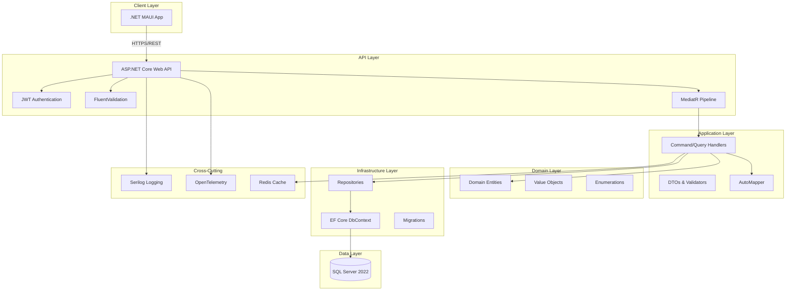

# XYZ Financials Securities MVP

## Architecture Overview

## Key Features

### 1. Loan Management
- Application processing and tracking
- Loan origination and servicing
- Payment processing and escrow management
- Document management

### 2. Customer Management
- Customer profiles and credit assessment
- Risk evaluation and scoring
- Multi-address support
- Employment and income tracking

### 3. Securities & Capital Markets
- MBS securitization tracking
- Capital market data integration
- Servicing rights management
- CUSIP/security mapping

### 4. Financial Operations
- Payment processing and allocation
- Escrow account management
- Default and foreclosure tracking
- Loan modifications

### 5. Compliance & Audit
- Comprehensive audit logging
- Document tracking and approval
- Risk assessment workflow
- Regulatory reporting ready

## Technology Stack

### Backend
- **Framework**: .NET 8
- **ORM**: Entity Framework Core 8
- **Patterns**: CQRS with MediatR, Repository Pattern
- **Validation**: FluentValidation
- **Mapping**: AutoMapper
- **Authentication**: JWT Bearer Tokens
- **Logging**: Serilog (Console + File + Seq)
- **Monitoring**: OpenTelemetry + Prometheus
- **Caching**: Redis (optional)
- **Resiliency**: Polly

### Frontend
- **Framework**: .NET MAUI
- **Pattern**: MVVM with CommunityToolkit.Mvvm
- **Navigation**: Shell Navigation
- **HTTP**: HttpClient with Polly
- **UI**: Material Design inspired

### Database
- **RDBMS**: Microsoft SQL Server 2022
- **Migrations**: EF Core Migrations
- **Seeding**: EF Core + CSV Import

### DevOps
- **Containers**: Docker + Docker Compose
- **CI/CD**: GitHub Actions
- **IaC**: Docker Compose configurations
- **Testing**: xUnit, FluentAssertions, Testcontainers

### Using Swagger UI

Navigate to https://localhost:5001/swagger and use the "Authorize" button with your JWT token.

## Monitoring & Observability

### Logs Location
- Console: Structured JSON logs
- File: `logs/xyz-financials-.log`
- Seq (optional): http://localhost:5341

### Metrics
- Prometheus: http://localhost:5001/metrics
- Health: http://localhost:5001/health
- Ready: http://localhost:5001/ready

### OpenTelemetry
- Traces exported to console (configurable to Jaeger/Zipkin)
- Metrics exported to Prometheus

