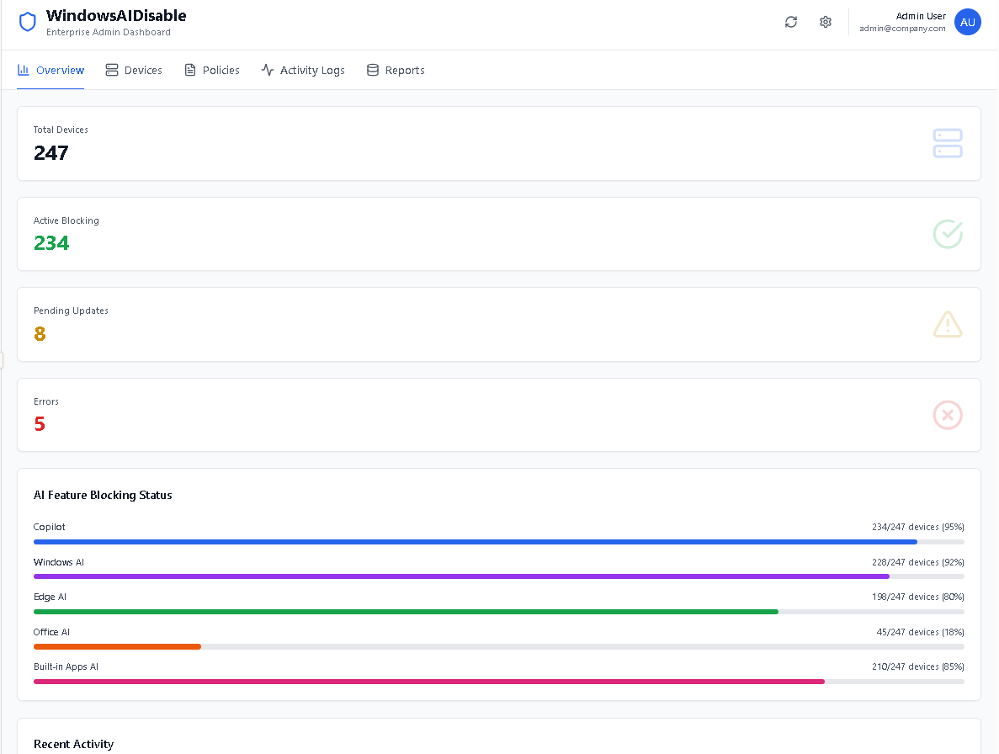
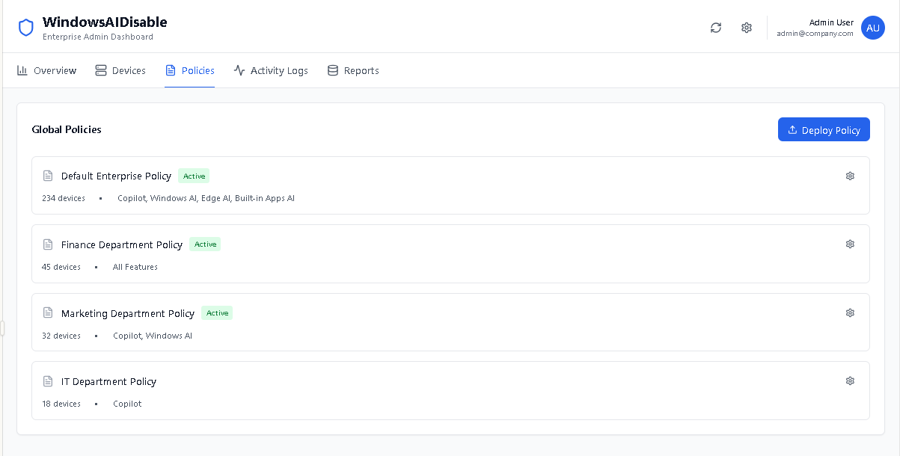
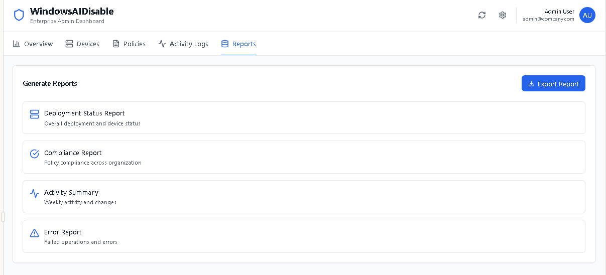
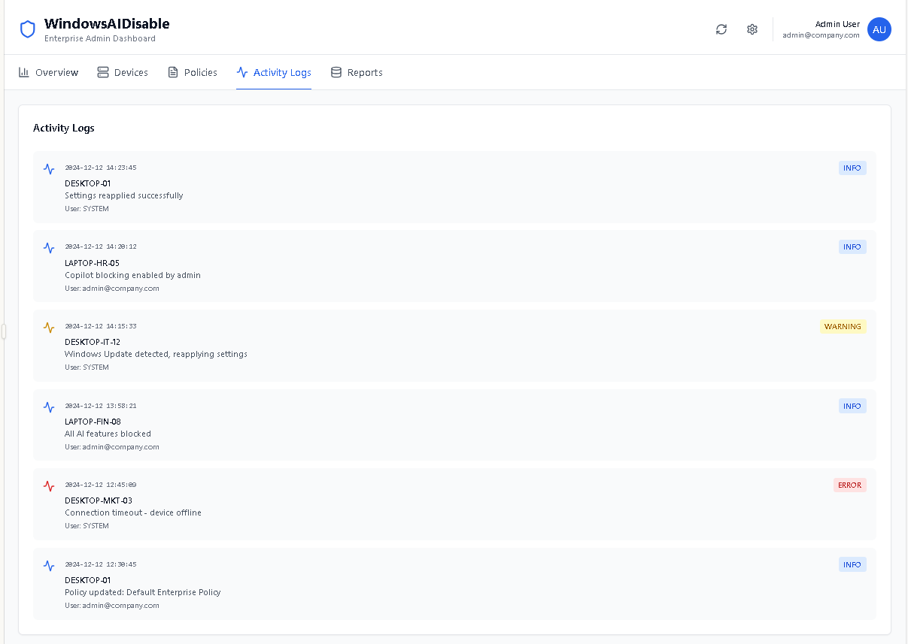

# WindowsAIDisable MVP - .NET WinForms

**Version:** 1.0.0  
**Last Updated:** 20YY-MM-DD

---

## Table of Contents
1. [Overview](#overview)
2. [Programming Languages](#programming-languages)
3. [Frameworks & Libraries](#frameworks--libraries)
4. [Development Tools](#development-tools)
5. [Database](#database)
6. [Deployment](#deployment)
7. [Testing](#testing)
8. [Dependencies](#dependencies)

---

## Overview

### 🎬 Demo
- MVP Dashboard <br/>
  <br/>

- MVP Device List <br/>
  <br/>

- MVP Policies List <br/>
  <br/>

- MVP Reports List <br/>
  <br/>

- MVP Activity Log<br/>
  <br/>

WindowsAIDisable is built using modern Microsoft technologies with a focus on:
- **Performance**: Minimal resource usage
- **Compatibility**: Wide Windows 11 support
- **Maintainability**: Clean, documented code
- **Security**: No external dependencies at runtime

### Architecture Pattern
**Pattern**: Model-View-Controller (MVC) with Service Layer

```
┌─────────────────────────────────────────┐
│          Presentation Layer              │
│  (SystemTrayApp, UI Components)         │
└──────────────────┬──────────────────────┘
                   │
┌──────────────────▼──────────────────────┐
│          Service Layer                   │
│  (AIDisableService, RegistryService,    │
│   ConfigurationManager, Logger)         │
└──────────────────┬──────────────────────┘
                   │
┌──────────────────▼──────────────────────┐
│          Data Layer                      │
│  (DatabaseService, SQLite)              │
└─────────────────────────────────────────┘
```

---

## Programming Languages

### Primary Language: C# 10.0

**Version**: C# 10.0 (.NET 6.0) / C# 8.0 (.NET Framework 4.8)
**Rationale**:
- Native Windows API access
- Strong typing and null safety
- Excellent tooling (Visual Studio, Rider)
- Large ecosystem of libraries
- Cross-.NET version compatibility


### Secondary Language: PowerShell 5.1+

**Purpose**: Group Policy deployment, automation scripts


---

## Frameworks & Libraries

### UI Framework: Windows Forms (WinForms)

**Version**: .NET 6.0 / .NET Framework 4.8

**Rationale**:
- Lightweight compared to WPF
- Native Windows look and feel
- Perfect for system tray applications
- Minimal dependencies

**Alternative Considered**: WPF
- ❌ Heavier runtime footprint
- ❌ Overkill for simple tray application
- ✅ WinForms sufficient for MVP

---

## Development Tools
### IDE: Visual Studio 2022 / JetBrains Rider

**Visual Studio 2022**
- **Edition**: Community (free) / Professional / Enterprise
- **Workload**: .NET desktop development
- **Extensions**:
  - ReSharper (optional, for enhanced C# support)
  - CodeMaid (code cleanup)
  - GhostDoc (documentation generation)

**JetBrains Rider**
- **Version**: 2023.3+
- **Advantages**: Cross-platform, faster than VS, better refactoring

### Version Control: Git + GitHub

**Repository Structure**:
```
WindowsAIDisable/
├── .github/
├── src/
├── tests/
├── docs/                   # Documentation
├── scripts/                # PowerShell scripts
└── installer/              # WiX installer project
```

---

## Database
### SQLite 3

**Version**: 3.40.0+  
**NuGet Package**: `System.Data.SQLite` (v1.0.118)

**Rationale**:
- **Zero Configuration**: No server required
- **Portable**: Single file database
- **Performance**: Fast for local data
- **Reliability**: ACID compliant
- **Size**: < 1MB library
- **Database Location**:
- **Schema Management**:
- **Alternative Considered**: LiteDB
    - ✅ More modern API
    - ❌ Less mature than SQLite
    - ❌ Smaller community

---

## Deployment

### Installer: WiX Toolset v4

**Purpose**: Create MSI installer packages

**Features**:
- Windows Installer (MSI) format
- Add/Remove Programs integration
- Upgrade/uninstall support
- Silent installation mode
- Custom actions for initial setup

**Build Output**:
```
WindowsAIDisable-1.0.0-x64.msi
WindowsAIDisable-1.0.0-x86.msi
```

### Portable Deployment
**Format**: ZIP archive

### Code Signing
**Tool**: SignTool.exe (Windows SDK)
**Certificate Requirements**:
- EV Code Signing Certificate (recommended)
- Standard Code Signing Certificate (minimum)


---

## Testing

### Unit Testing: xUnit.net
### Mocking: Moq
### Integration Testing
### Manual Testing

---

## Dependencies
### Runtime Dependencies
#### .NET 6.0 Dependencies
#### PowerShell Dependencies
### Development Dependencies
### Build Dependencies

---

## System Requirements
### Minimum Requirements

| Component | Requirement |
|-----------|-------------|
| **OS** | Windows 11 (build 22000+) |
| **CPU** | 1 GHz or faster |
| **RAM** | 2 GB |
| **Disk** | 100 MB free space |
| **.NET** | .NET 6.0 Runtime or .NET Framework 4.8 |
| **Privileges** | Administrator rights |

### Recommended Requirements

| Component | Recommendation |
|-----------|----------------|
| **OS** | Windows 11 23H2 |
| **CPU** | 2 GHz dual-core |
| **RAM** | 4 GB |
| **Disk** | 500 MB free space |
| **.NET** | .NET 6.0 Runtime (bundled) |

---

## Performance Characteristics

### Resource Usage

| Metric | Value |
|--------|-------|
| **Startup Time** | < 2 seconds |
| **Memory Footprint** | 30-50 MB |
| **CPU Usage (Idle)** | < 0.5% |
| **CPU Usage (Active)** | 1-3% |
| **Disk I/O** | Minimal (database operations only) |
| **Network** | Zero (fully offline) |

### Database Performance

| Operation | Average Time |
|-----------|--------------|
| **Read Setting** | < 1 ms |
| **Write Setting** | < 5 ms |
| **Bulk Read** | < 10 ms |
| **Database Open** | < 50 ms |

---

## Security Considerations
### Code Security
### Data Security

---

## Build Configuration
### Debug Build
### Release Build

---

## Continuous Integration
### GitHub Actions Workflow
## Alternatives Considered

### Language Alternatives

| Alternative | Pros | Cons | Decision |
|-------------|------|------|----------|
| **C++** | Native performance | Complex, slower development | ❌ Rejected |
| **Python** | Rapid development | Requires runtime, slower | ❌ Rejected |
| **Rust** | Memory safety, performance | Steeper learning curve | ❌ Future consideration |
| **C#** | Great tooling, Windows integration | Requires .NET | ✅ **Selected** |

### Framework Alternatives

| Alternative | Pros | Cons | Decision |
|-------------|------|------|----------|
| **WPF** | Modern UI, rich features | Heavier runtime | ❌ Rejected |
| **Avalonia** | Cross-platform | Immature ecosystem | ❌ Rejected |
| **WinForms** | Lightweight, mature | Limited modern UI | ✅ **Selected** |

---

