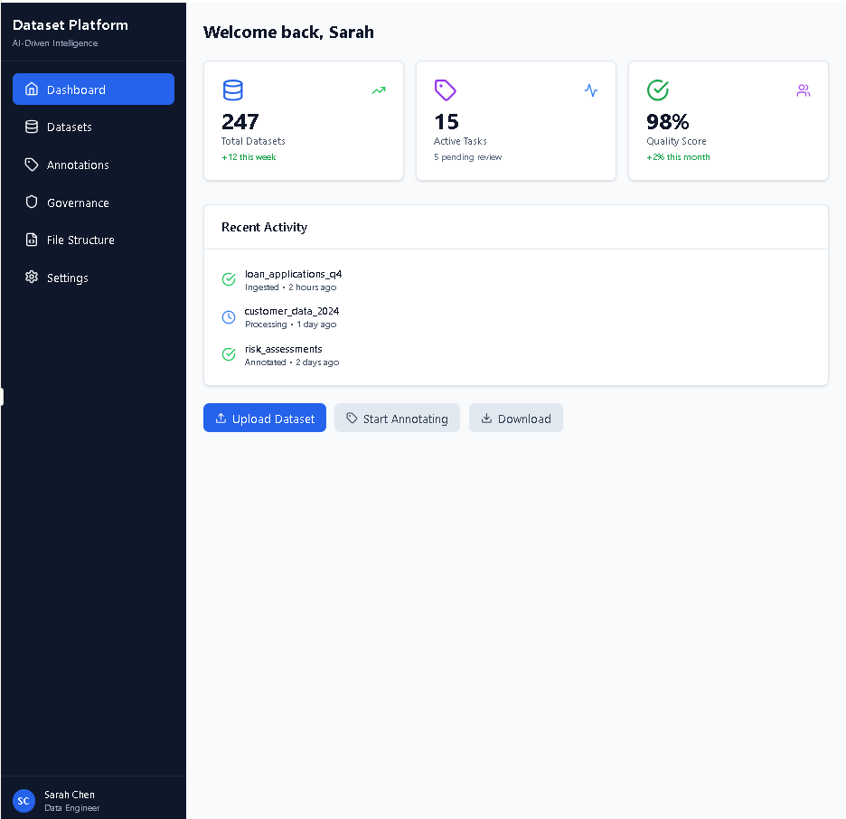
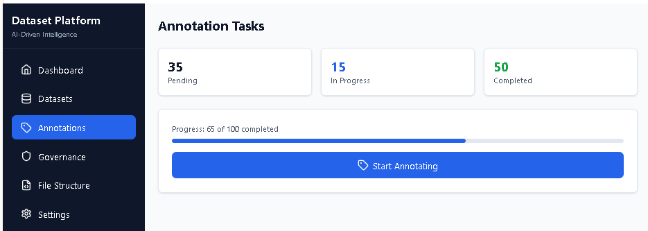
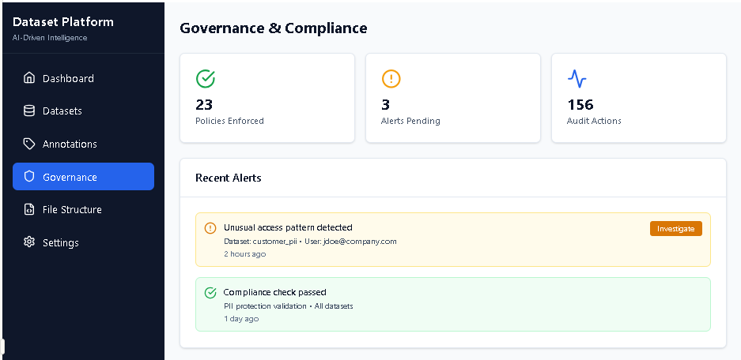

# AI-Driven Dataset Intelligence Platform — MVP

ML dataset engineering system : AI-driven dataset intelligence platform focused on ingestion, curation, annotation, dataset versioning, governance, and ML dataset preparation.

---
## 🎯 Usage

### Admin Dashboard

### Datasets Dashboard

### Annotations Dashboard

### Governance Dashboard

### FileStructure Dashboard

---

## Key features
- Batch + incremental ingestion from SQL Server and external APIs
- Data curation: validation, duplicate detection, outlier flagging, quality metrics
- Annotation workflows (multi-label, entity extraction, document-level) with Label Studio integration
- Dataset versioning with full lineage and semantic versions (MAJOR.MINOR.PATCH)
- Governance: PII protection, RBAC, audit logs and compliance reporting
- Feature engineering & dataset preparation (CSV / Parquet / TFRecord)
- RESTful API with OpenAPI / Swagger documentation

## High-level architecture
- Frontend: React
- API gateway: Kong (optional)
- Backend: FastAPI services (ingestion, annotation, governance, feature store)
- Storage: S3-compatible object storage, PostgreSQL for metadata, Vector DB for embeddings
- Workers: Celery (Redis broker) for background jobs
- Observability: Prometheus metrics, structured JSON logs

## Quickstart (local)

Prerequisites
- Node.js 18+ (frontend)
- Python 3.11+ (backend)
- Docker & Docker Compose
- PostgreSQL and Redis (can be run via Docker)

---

