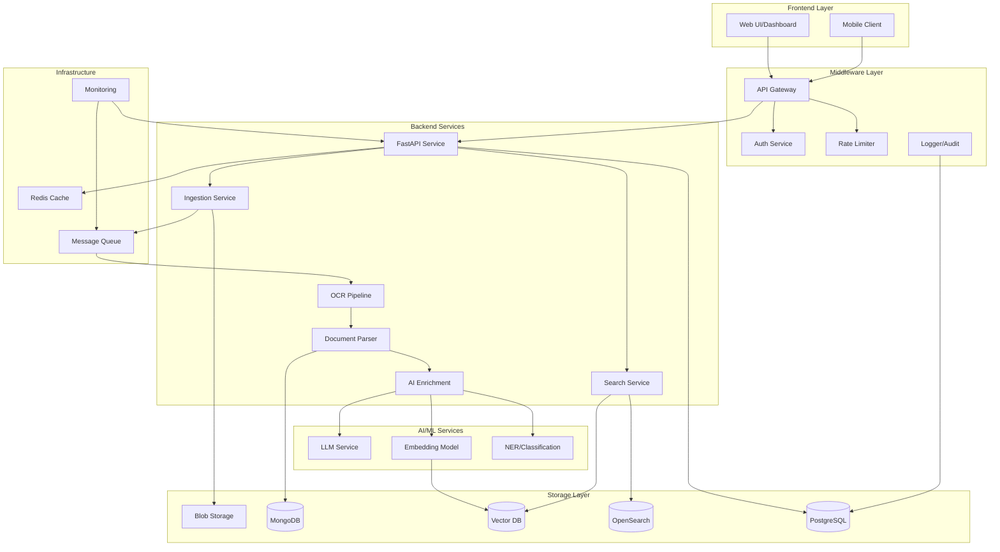

# AI-Driven Document Intelligence Platform - MVP

## 🚀 Overview

A production-grade, enterprise-ready document intelligence platform that ingests, processes, and analyzes documents using state-of-the-art AI technology. The system supports OCR, natural language processing, semantic search, and intelligent document management.

### Key Features

- **Multi-Format Support**: PDF, DOCX, TXT, images (PNG, JPG), HTML
- **Advanced OCR**: High-accuracy text extraction from scanned documents
- **AI Enrichment**: Automated summarization, entity extraction, topic modeling
- **Hybrid Search**: Combined keyword and semantic search for optimal results
- **Scalable Architecture**: Microservices design with horizontal scaling
- **Enterprise Security**: RBAC, encryption, audit logs, compliance-ready
- **Real-time Processing**: Async document pipeline with progress tracking
- **RESTful API**: Complete API with OpenAPI documentation

### Technology Stack

**Backend**: Python 3.11+, FastAPI, Celery  
**Databases**: MongoDB, PostgreSQL, Redis  
**Search**: OpenSearch, Weaviate (Vector DB)  
**AI/ML**: OpenAI GPT-4, Tesseract OCR, Transformers  
**Storage**: S3/Azure Blob/GCS compatible  
**Infrastructure**: Docker, Kubernetes, Terraform  

---

## 📋 Table of Contents

1. [Quick Start](#quick-start)
2. [Architecture](#architecture)
3. [Installation](#installation)
4. [Development](#development)
5. [API Documentation](#api-documentation)
6. [Testing](#testing)
7. [Deployment](#deployment)
8. [Contributing](#contributing)
9. [License](#license)

---

## ⚡ Quick Start

### Prerequisites

- Docker 24.x+ and Docker Compose
- Python 3.11+ (for local development)
- 8GB RAM minimum, 16GB recommended
- OpenAI API key (for AI features)

### One-Command Setup

### Test the API

---

## 🏗️ Architecture

### High-Level Architecture

```
┌─────────────────────────────────────────────────────────┐
│                    Frontend Layer                        │
│  React SPA, Mobile Apps, Developer Console              │
└─────────────────────┬───────────────────────────────────┘
                      │
┌─────────────────────▼───────────────────────────────────┐
│                  Middleware Layer                        │
│  API Gateway, Auth, Rate Limiting, Logging              │
└─────────────────────┬───────────────────────────────────┘
                      │
┌─────────────────────▼───────────────────────────────────┐
│                   Backend Services                       │
│  Ingestion → OCR → Parsing → Enrichment → Indexing     │
└─────────────────────┬───────────────────────────────────┘
                      │
┌─────────────────────▼───────────────────────────────────┐
│                 Storage & Search Layer                   │
│  MongoDB, PostgreSQL, Vector DB, OpenSearch, S3         │
└─────────────────────────────────────────────────────────┘
```

### Document Processing Pipeline

```
Upload → Validation → Virus Scan → Blob Storage
   ↓
Message Queue (RabbitMQ)
   ↓
OCR Pipeline (if needed)
   ↓
Document Parser
   ↓
AI Enrichment (Summary, Entities, Topics)
   ↓
Generate Embeddings
   ↓
Index (MongoDB + OpenSearch + Vector DB)
   ↓
Complete → Notify User
```
---

### Data Flow Diagram




## 🔧 Installation

### Local Development (Without Docker)

#### 1. Install System Dependencies

**macOS:**
**Ubuntu/Debian:**

#### 2. Setup Python Environment

#### 3. Configure Environment

#### 4. Initialize Databases

#### 5. Start Services

```bash
# Terminal 1: API Server

# Terminal 2: Celery Worker

# Terminal 3: Frontend
```

---

## 💻 Development

### Project Structure

```
document-intelligence-platform/
├── backend/
├── frontend/
├── infrastructure/
├── docs/
├── .env.example
├── .gitignore
└── README.md
```

### Code Style

### Pre-commit Hooks

---

## 📚 API Documentation

### Interactive Documentation

- **Swagger UI**: http://localhost:8000/api/docs
- **ReDoc**: http://localhost:8000/api/redoc
- **OpenAPI Spec**: http://localhost:8000/api/openapi.json

### Quick API Examples

#### Upload Document

#### Search Documents

---

## 🧪 Testing

### Run All Tests

### Performance Testing
---

## 🚀 Deployment

### Docker Production Build

### Kubernetes Deployment

### Cloud Deployment

**AWS**:
**Azure**:

---

## 📊 Monitoring

### Metrics Dashboard

Access Grafana: http://localhost:3001

Default credentials:
- Username: admin
- Password: admin

### Key Metrics

- API request rate and latency
- Document processing throughput
- Search query performance
- Database connection pool
- Cache hit rates
- Error rates by endpoint

### Alerts

Configured alerts for:
- High error rate (> 5%)
- Slow API responses (p95 > 500ms)
- Database connection failures
- High memory usage (> 90%)

---

## 🔐 Security

### Security Features

- JWT-based authentication with refresh tokens
- Role-Based Access Control (RBAC)
- API rate limiting (per user/IP)
- Encryption at rest (AES-256)
- Encryption in transit (TLS 1.3)
- Input validation and sanitization
- SQL injection prevention
- XSS protection
- CSRF protection

### Security Audits

### Development Workflow

### Code Review Process

- All PRs require 2 approvals
- CI/CD pipeline must pass
- Code coverage must not decrease
- Documentation must be updated

---

## 🙏 Acknowledgments

- OpenAI for GPT models and embeddings
- Tesseract OCR team
- FastAPI community
- All open-source contributors


---

**Version**: 1.0.0  
**Last Updated**: December 2025  
**Status**: Production Ready ✅

---

