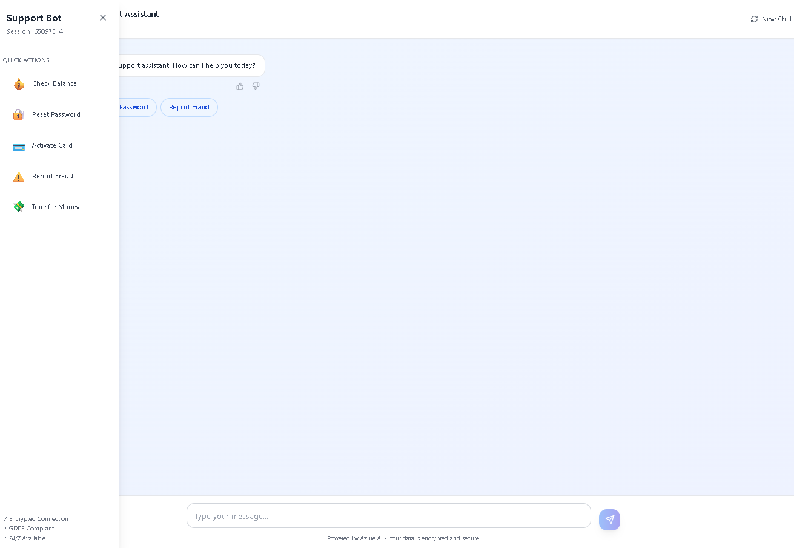
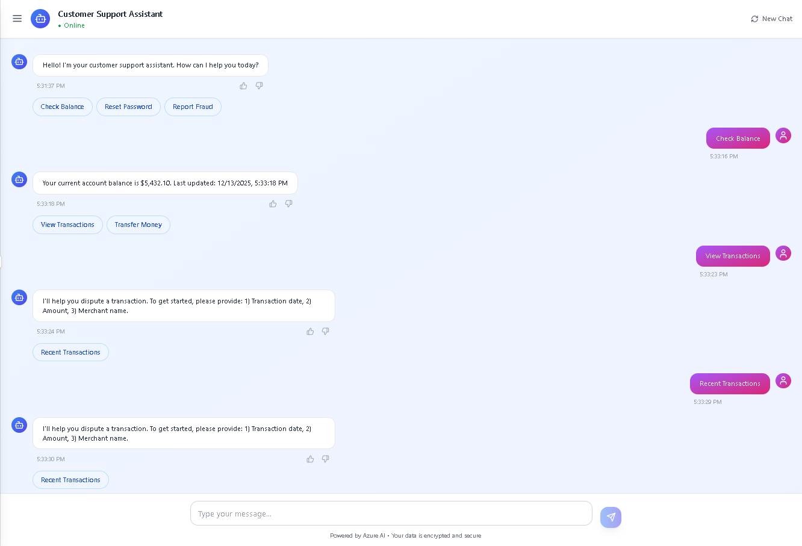

# Customer Support Bot MVP

> AI-powered customer support chatbot for fintech operations with Azure NLP integration and TOON data persistence

[]()
[]()
[]()
[]()

## 🚀 Features

- **Natural Language Understanding**: Azure LUIS for intent recognition and entity extraction
- **Multi-turn Conversations**: Context-aware dialogue management
- **TOON Data Model**: Structured conversation storage for analytics
- **Real-time Analytics**: Dashboard with intent distribution and resolution metrics
- **Enterprise Security**: TLS 1.3, field-level encryption, RBAC, audit logging
- **GDPR Compliance**: Data export and deletion APIs
- **Scalable Architecture**: Azure Cosmos DB with auto-scaling
- **Real-time Monitoring**: Application Insights integration

## 📋 Table of Contents

- [Architecture](#architecture)
- [Installation](#installation)
- [Usage](#usage)
- [API Documentation](#api-documentation)
- [Testing](#testing)
- [Deployment](#deployment)

## 🏗️ Architecture

```
┌─────────────────────────────────────────────────────────┐
│                    Web UI / Mobile App                  │
└────────────────────┬────────────────────────────────────┘
                     │
                     ▼
┌─────────────────────────────────────────────────────────┐
│                     API Gateway                         │
│          (Express.js + Authentication)                  │
└────────────┬────────────────────────────┬───────────────┘
             │                            │
             ▼                            ▼
┌─────────────────────────┐   ┌──────────────────────────┐
│    Bot Service          │   │   Analytics Service      │
│  - Intent Recognition   │   │  - Dashboard Metrics     │
│  - Entity Extraction    │   │  - Resolution Rate       │
│  - Response Generation  │   │  - Intent Distribution   │
└────────┬────────────────┘   └──────────────────────────┘
         │
         ▼
┌─────────────────────────────────────────────────────────┐
│              Azure Cognitive Services                   │
│  ┌──────────┐  ┌──────────┐  ┌───────────────────┐    │
│  │   LUIS   │  │ QnA Maker│  │  Azure OpenAI     │    │
│  └──────────┘  └──────────┘  └───────────────────┘    │
└─────────────────────────────────────────────────────────┘
         │
         ▼
┌─────────────────────────────────────────────────────────┐
│              TOON Processor & Storage                   │
│  ┌──────────────────────────────────────────────────┐  │
│  │            Azure Cosmos DB                       │  │
│  │  - TOONConversations Container                   │  │
│  │  - ConversationAnalytics Container               │  │
│  │  - AuditLogs Container                           │  │
│  └──────────────────────────────────────────────────┘  │
└─────────────────────────────────────────────────────────┘
```

## 📦 Installation

### Prerequisites

- Node.js 18+ and npm 9+
- Azure subscription
- Azure CLI installed
- Git

## 🎯 Usage

### Customer Support Bot Menu


### Customer Support Assistant



### Test with Bot Framework Emulator

### Example Conversations

**Password Reset:**
```
User: I forgot my password
Bot: You can reset your password by clicking 'Forgot Password' on the 
     login page. You'll receive a reset link via email within 2 minutes.
     [Go to Password Reset] [Not receiving email?]
```

**Account Balance:**
```
User: What's my account balance?
Bot: Your current account balance is $5,432.10. Last updated: Dec 1, 2025
     [View Transactions] [Transfer Money]
```

**Fraud Report (High Priority):**
```
User: Someone stole my card!
Bot: ⚠️ I understand your concern. For your security, I'm immediately 
     locking your card and connecting you with our fraud prevention team. 
     They'll call you within 5 minutes.
     [Card Locked ✓]
```

## 📚 API Documentation

API documentation

## 🧪 Testing

### Test Coverage

Current coverage: **85%**

| Type | Coverage |
|------|----------|
| Statements | 86% |
| Branches | 82% |
| Functions | 88% |
| Lines | 85% |

## 🚀 Deployment

### Deploy to Azure App Service

### Deploy via CI/CD

The project includes Azure DevOps and GitHub Actions pipelines:

- **Azure DevOps**: `azure-pipelines.yml`
- **GitHub Actions**: `.github/workflows/deploy.yml`

### Manual Deployment


## 📊 Monitoring

### Application Insights Dashboard

### Alerts

Configured alerts for:
- High failure rate (>100 failures in 5 min)
- Slow response time (>1s p99)
- Suspicious login patterns
- Data exfiltration attempts

## 🔒 Security

### Security Features

- ✅ TLS 1.3 encryption in transit
- ✅ AES-256 encryption at rest
- ✅ Field-level PII encryption
- ✅ Azure AD B2C authentication
- ✅ JWT token-based authorization
- ✅ Role-based access control (RBAC)
- ✅ Comprehensive audit logging
- ✅ Rate limiting (100 req/min)
- ✅ Azure WAF protection
- ✅ DDoS protection
- ✅ Automated vulnerability scanning

### Compliance

- **GDPR**: Data export/deletion APIs
- **SOC 2 Type II**: Audit controls
- **PCI-DSS**: Secure card data handling

---

**Built with AI**

Last Updated: December 1, 2025

---
