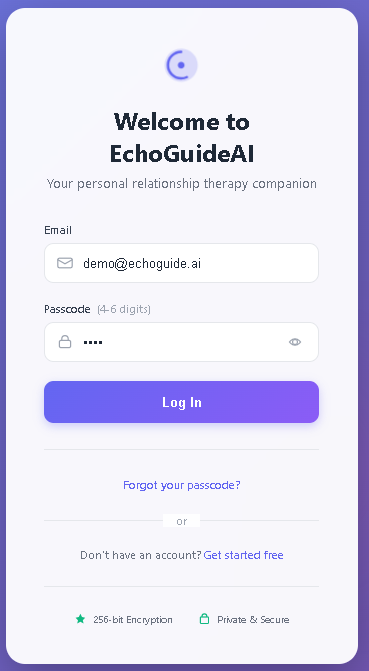
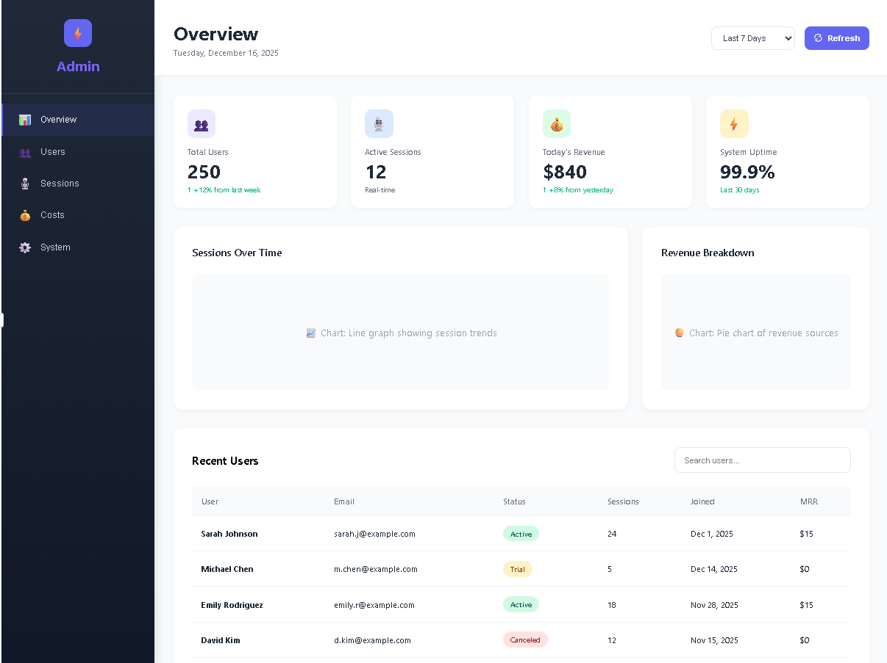

# EchoGuideAI - Relationship Voice Therapy App

## Overview
EchoGuideAI is a real-time voice therapy application built on the Vibe platform, designed for daily 10-15 minute guided relationship coaching sessions. It features low-latency voice interaction, structured conversation flows, and cost-optimized STT/TTS infrastructure.

## Features
- ✅ Real-time voice interaction (sub-500ms latency)
- ✅ Interruptible conversation flows
- ✅ Structured multi-step therapy sessions
- ✅ User authentication with passcode
- ✅ Session memory and tracking
- ✅ Optional Stripe payment integration
- ✅ Cost-optimized voice stack ($0.02-0.05 per session)

---
## 🎯 Usage

### IOS Login Dashboard


### Web Dashboard

---

## Tech Stack
- **Platform**: <a href="https://microsoft.github.io/VibeVoice/">Vibe (voice app framework)</a>
- **Backend**: Node.js + Express
- **Database**: PostgreSQL
- **STT**: Deepgram Nova-2 (primary), Faster-Whisper (fallback)
- **TTS**: Azure Neural TTS (primary), PlayHT (backup)
- **LLM**: OpenAI GPT-4-turbo (minimal usage via RAG)
- **Payment**: Stripe (optional)
- **Deployment**: Railway/Render/AWS


## Prerequisites
- Node.js 18+ and npm/yarn
- PostgreSQL 14+
- Vibe CLI installed (`npm install -g @vibe/cli`)
- API keys for:
  - Deepgram
  - Azure Speech Services
  - OpenAI (optional, for advanced features)
  - Stripe (optional, for payments)


## Testing
### Run All Tests
### Test Voice Flow
### Test STT/TTS Integration

## Deployment
### Deploy to Railway
### Deploy to Render
### Deploy to AWS

## Usage

### User Flow
1. **Sign Up**: Create account with email/passcode
2. **Start Session**: Click "Begin Today's Session"
3. **Voice Interaction**: Speak naturally, AI responds in real-time
4. **Complete Session**: 10-15 minute structured conversation
5. **Review**: See session summary and insights


## Cost Optimization
### Expected Costs per Session
- STT (Deepgram): $0.0043 (15 min @ $0.0043/min)
- TTS (Azure): $0.024 (800 words @ $0.000030/char)
- LLM (minimal): $0.01 (RAG-optimized)
- **Total: ~$0.04 per session**

### Optimization Strategies
1. Use Deepgram Nova-2 (lowest cost, high quality)
2. Batch TTS requests where possible
3. Implement aggressive RAG to minimize LLM calls
4. Cache common responses
5. Use local Whisper for fallback (free)


## API Documentation
### Authentication
```bash
POST /api/auth/register
POST /api/auth/login
POST /api/auth/refresh
```

### Sessions
```bash
GET /api/sessions
POST /api/sessions/start
POST /api/sessions/:id/complete
GET /api/sessions/:id
```

### Voice
```bash
WS /api/voice/stream
POST /api/voice/transcribe
POST /api/voice/synthesize
```


---

**Version**: 1.0.0  
**Last Updated**: December 2025  
**Maintainer**: Your Team