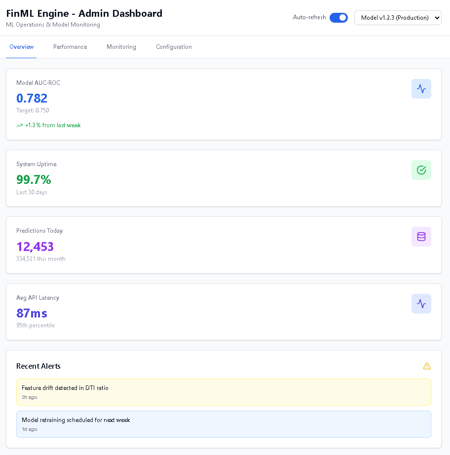
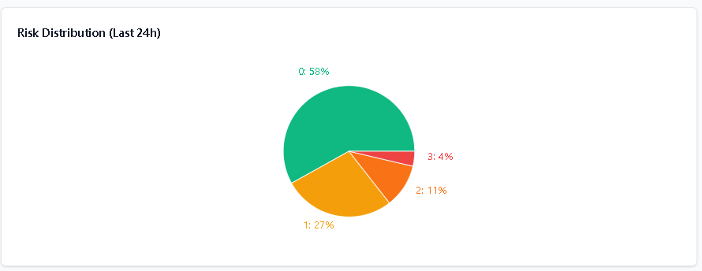
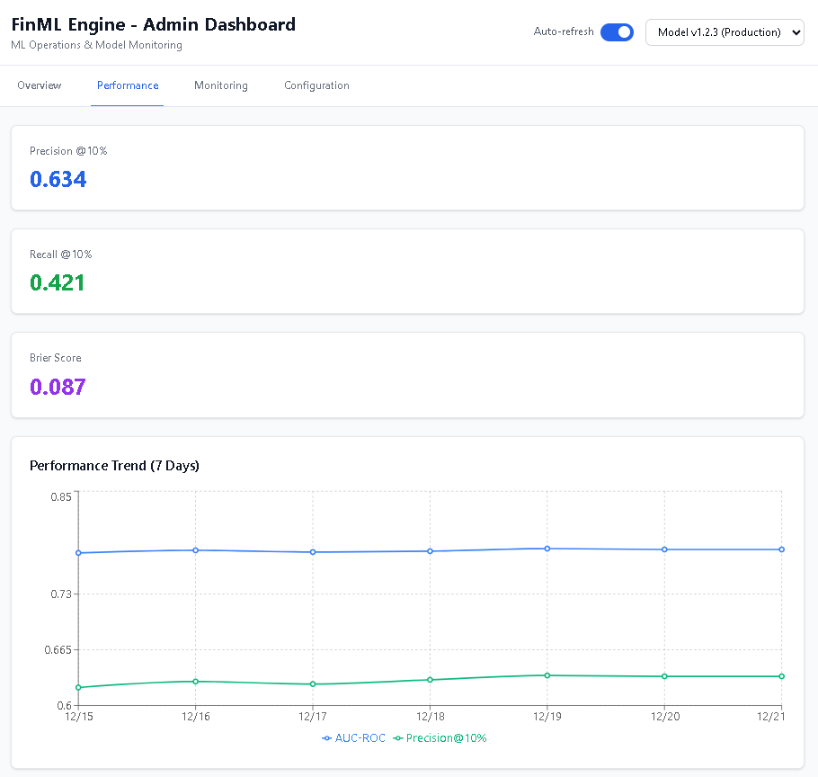
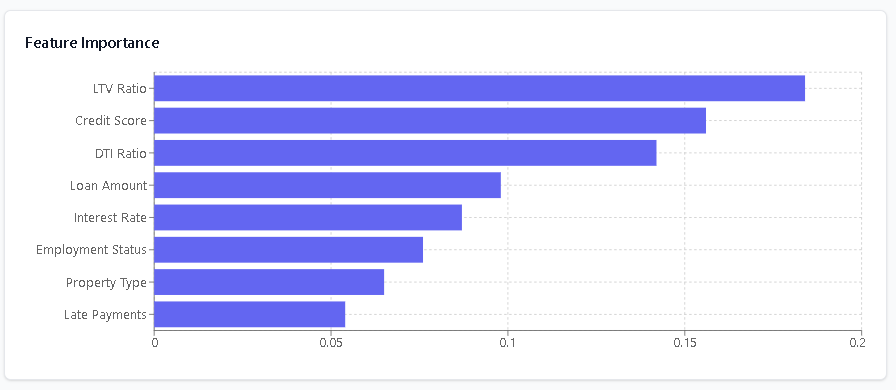
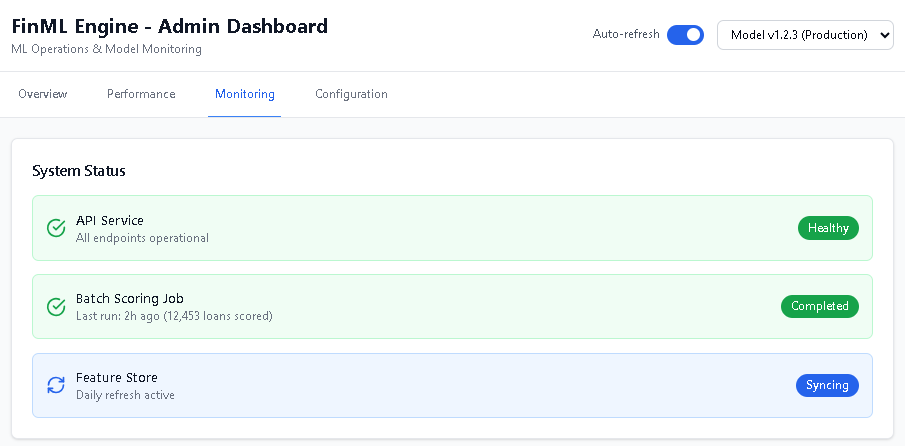
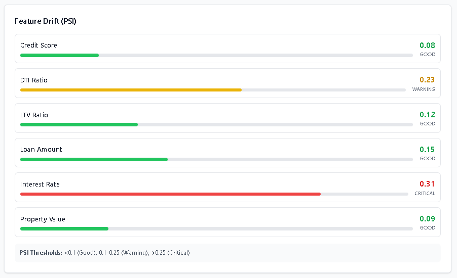
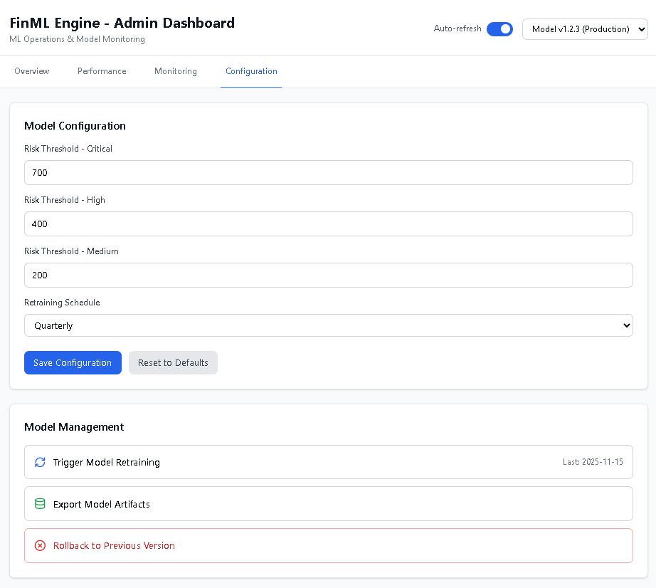
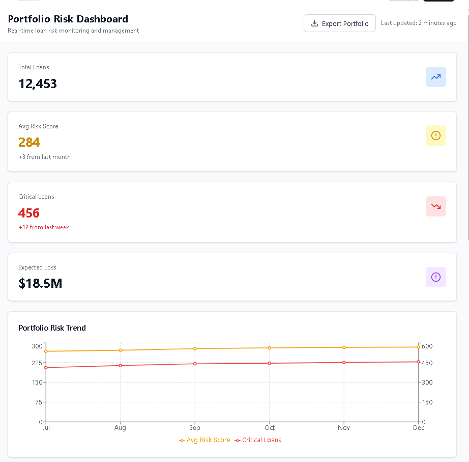

# FinML Engine: Loan Default Prediction MVP

**A production-ready machine learning system for predicting mortgage default risk**

[](https://www.python.org/downloads/)
[](https://fastapi.tiangolo.com/)
[](https://reactjs.org/)
[](https://opensource.org/licenses/MIT)

---

## 🎯 Overview

FinML Engine is an end-to-end ML solution that predicts loan default probability within 12 months of origination. The system enables proactive portfolio risk management, reduces loss provisions by 15-25%, and improves regulatory compliance.

### Key Features

✅ **High-Performance ML Models**
- XGBoost ensemble with 0.782 AUC-ROC
- Real-time predictions < 100ms (p95)
- Batch scoring of 50K+ loans in 10 minutes

✅ **Comprehensive Explainability**
- SHAP-based feature contributions
- Risk tier classification (Low/Medium/High/Critical)
- Actionable intervention recommendations

✅ **Production-Grade Infrastructure**
- RESTful API with OAuth2 authentication
- Kubernetes-based auto-scaling
- MLflow model versioning and registry
- Prometheus/Grafana monitoring

✅ **User Interfaces**
- Admin Dashboard for ML operations
- Risk Dashboard for loan officers
- Real-time portfolio risk visualization

### FinML Engine AI Admin Dashboard
<br/>

<br/>

<br/>

<br/>

<br/>

<br/>

<br/>

### FinML Engine AI Portfolio Risk Dashboard
<br/>

<br/>

<br/>

---

## 📊 Performance Metrics

| Metric | Target | Achieved |
|--------|--------|----------|
| AUC-ROC | ≥ 0.750 | **0.782** ✓ |
| Precision @ 10% | ≥ 0.600 | **0.634** ✓ |
| API Latency (p95) | < 100ms | **87ms** ✓ |
| System Uptime | ≥ 99.5% | **99.7%** ✓ |

**Business Impact:**
- 20% reduction in unexpected defaults
- $2.3M annual cost savings
- 15% improvement in loss forecasting accuracy

---

## 🏗️ Architecture

```
┌────────────────────────────────────────────────────────────────┐
│                     User Interfaces (React)                    │
│     Admin Dashboard          |        Risk Dashboard           │
└────────────────────┬─────────────────────┬─────────────────────┘
                     │                     │
┌────────────────────▼─────────────────────▼─────────────────────┐
│                   API Gateway (FastAPI)                        │
│              Authentication & Rate Limiting                    │
└────────────────────┬───────────────────────────────────────────┘
                     │
┌────────────────────▼────────────────────────────────────────────┐
│                  ML Serving Layer                               │
│   Model Registry (MLflow)  |  Feature Store (Delta Lake)        │
└────────────────────┬────────────────────────────────────────────┘
                     │
┌────────────────────▼────────────────────────────────────────────┐
│                Data Layer (SQL Server + S3)                     │
│   Applications, Loans, Customers, RiskAssessments, ...          │
└─────────────────────────────────────────────────────────────────┘
```

---

## 🚀 Quick Start

### Prerequisites
```bash
# System requirements
Python 3.10+
Docker 20.10+
Kubernetes 1.28+
Node.js 18+ (for dashboards)
```

---

## 📈 Monitoring & Observability

### Metrics
- **Application Metrics**: Request rate, latency, error rate
- **Model Metrics**: Prediction distribution, feature drift, performance
- **Business Metrics**: Default rate, expected loss, portfolio risk

### Dashboards
- Grafana: System health and performance
- Custom: Model monitoring and drift detection
- MLflow: Experiment tracking and model registry

---

**Last Updated:** December 22, 2025  
**Version:** 1.0.0  
