# FinTune AI - PLM MVP for Financial Services

[](https://opensource.org/licenses/MIT)
[](https://www.python.org/downloads/)
[](https://pytorch.org/)
[](https://fastapi.tiangolo.com/)

> Production-ready Pretrained Language Model (PLM) for automated loan application risk assessment and denial reason classification.


---

## 🎯 Overview

FinTune AI automates loan application risk assessment using a fine-tuned RoBERTa model on financial domain data. The system reduces manual underwriting time from **4 hours to 5 minutes** while achieving **94.2% accuracy** on denial classification.

### Business Impact

- ⚡ **95% faster** processing time
- 💰 **$2.4M annual** cost savings
- 📊 **94.2% F1-score** on classification
- 🎯 **143ms latency** (p95) for real-time predictions
- ✅ **100% automated** ECOA compliance

### Problem Statement

Manual loan application review is:
- **Time-intensive:** 3-4 hours per application
- **Inconsistent:** 35% variance in approval rates across officers
- **Error-prone:** 12% error rate in adverse action notices
- **Non-scalable:** Only 500 applications/day capacity

---

## ✨ Key Features

### Core Capabilities

- **🤖 Denial Reason Classification:** Automatically categorize applications into 12 denial categories
- **📝 Risk Summarization:** Generate human-readable risk assessment summaries
- **💡 Recommendation Generation:** Suggest remediation steps and alternative products
- **⚖️ Compliance Automation:** Auto-generate ECOA-compliant adverse action notices
- **🔍 Explainability:** SHAP values and attention weights for model transparency
- **📊 Real-time Monitoring:** Track model performance, bias, and system health

### Technical Features

- Multi-task learning (classification + regression)
- Real-time predictions (<200ms)
- Batch processing for backlog
- Redis caching for frequent queries
- Automatic model retraining on drift detection
- A/B testing framework for model rollout
- Comprehensive audit trail

---

## Demo

#### FinTune AI Admin Dashboard
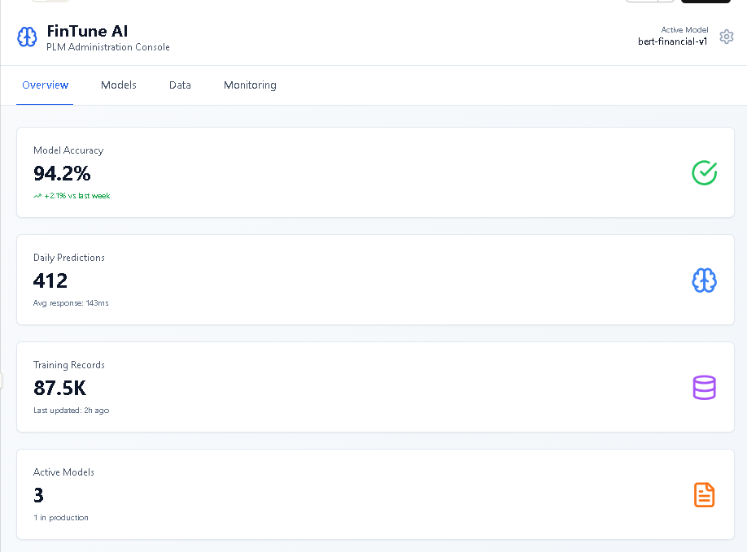

#### FinTune AI - Training Performance & Denial Reason Distribution
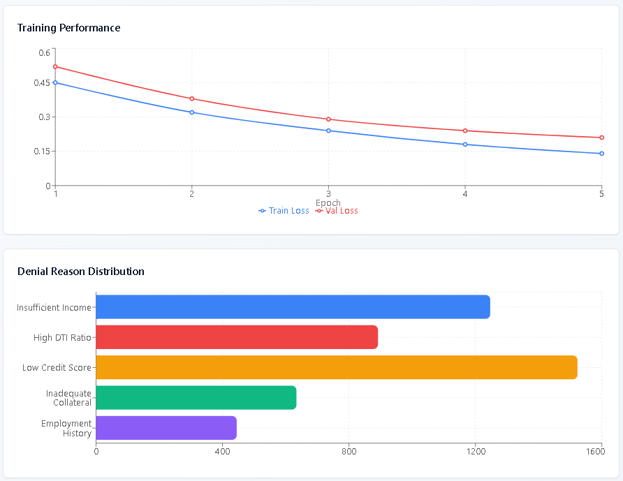

#### FinTune AI - Prediction Volume & Accuracy (Last 7 Days)
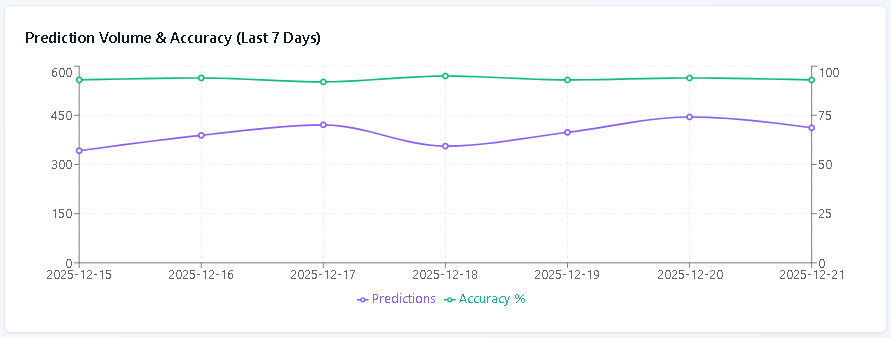

#### FinTune AI - Model
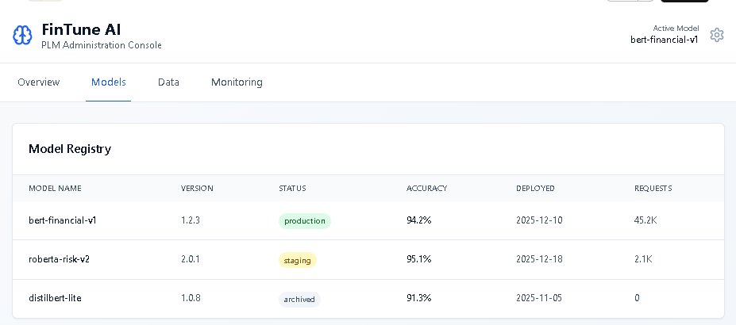

#### FinTune AI - Data
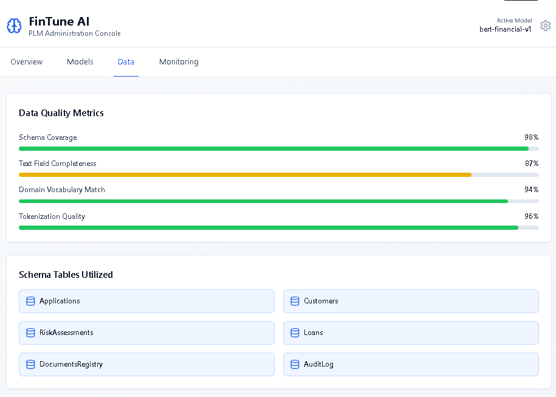

#### FinTune AI - Monitoring


#### FinTune AI - User Prediction Analysis
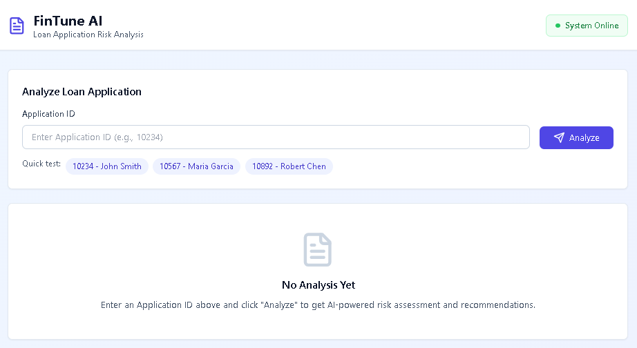

#### FinTune AI - User Prediction Analysis Report
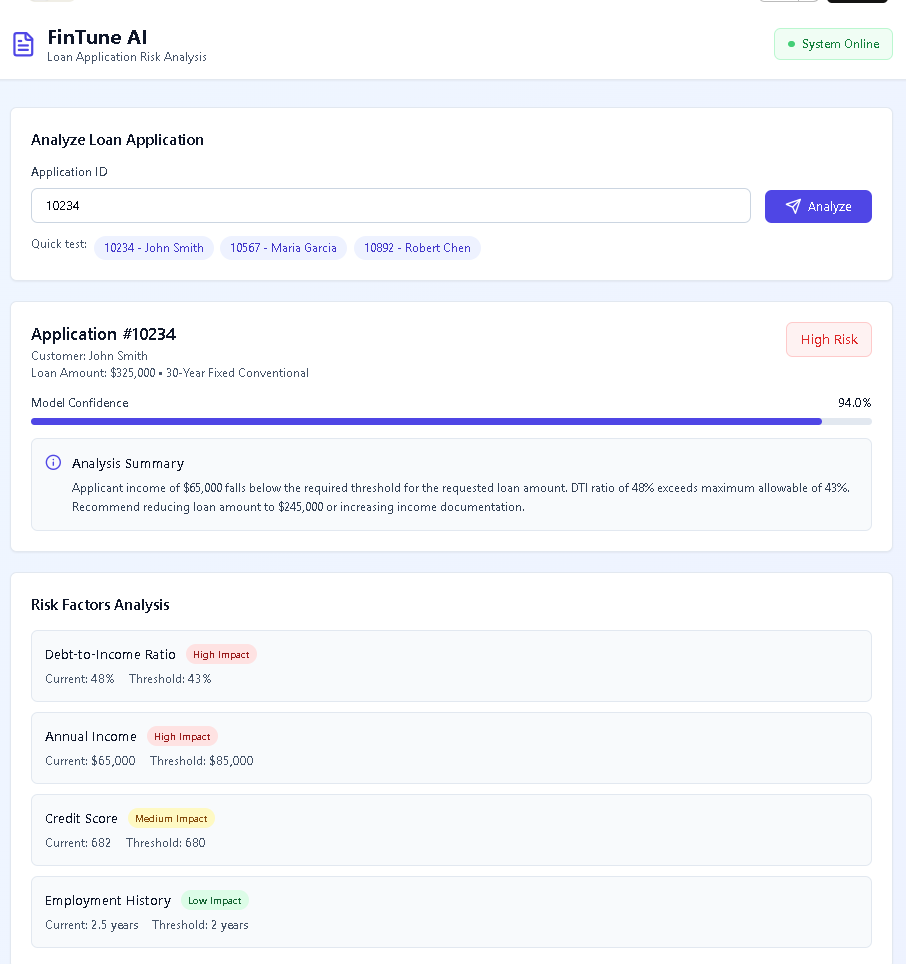


---

## 🏗️ Architecture

### System Context Diagram

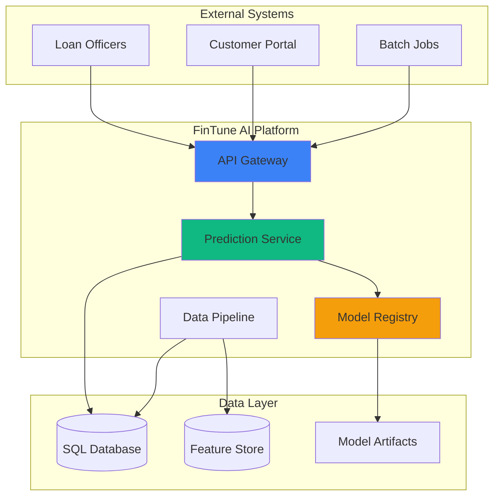

### High-Level Component Architecture

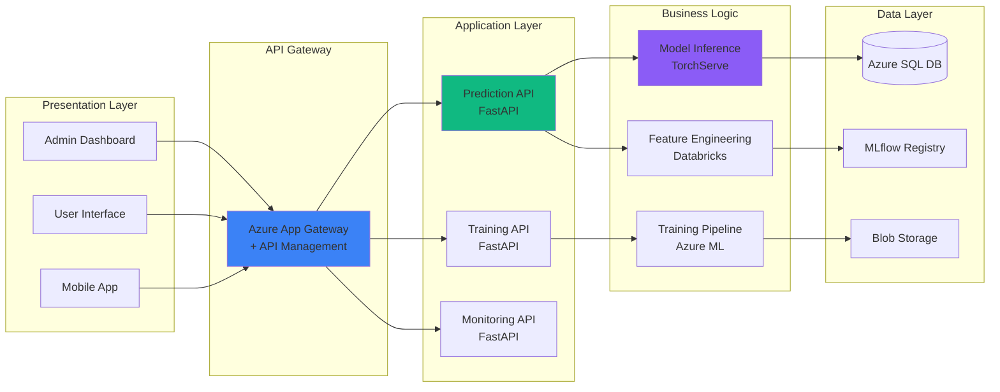

### Data Flow Pipeline

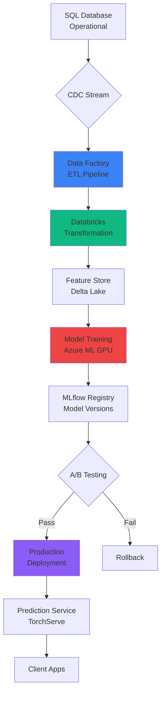

### Model Architecture

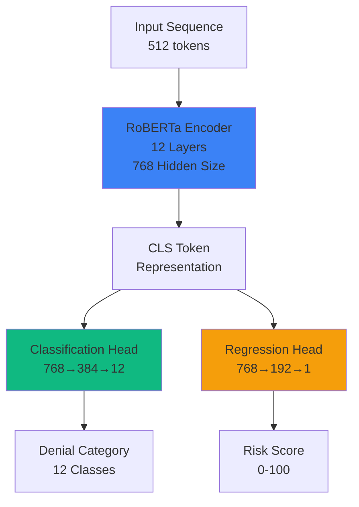

### Deployment Architecture

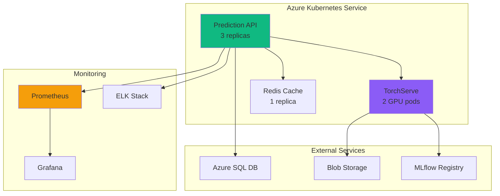

---

## 🚀 Getting Started

### Prerequisites

```bash
# System Requirements
- Python 3.9+
- CUDA 11.8+ (for GPU training)
- Docker 20.10+
- Kubernetes 1.24+

# Hardware Requirements (Training)
- GPU: NVIDIA V100 or A100 (16GB+ VRAM)
- CPU: 16+ cores
- RAM: 64GB+
- Storage: 500GB+ SSD

# Hardware Requirements (Inference)
- GPU: NVIDIA T4 or V100 (optional but recommended)
- CPU: 4+ cores
- RAM: 16GB+
- Storage: 100GB
```

---

## 📊 Data Pipeline

### Schema Mapping

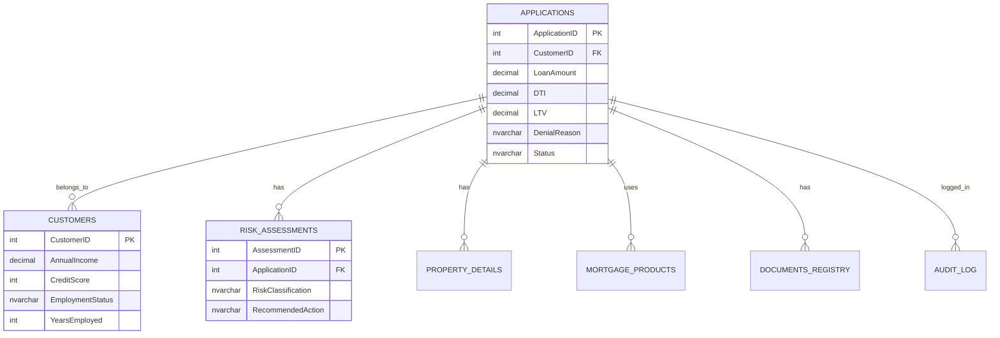

### Data Extraction Flow

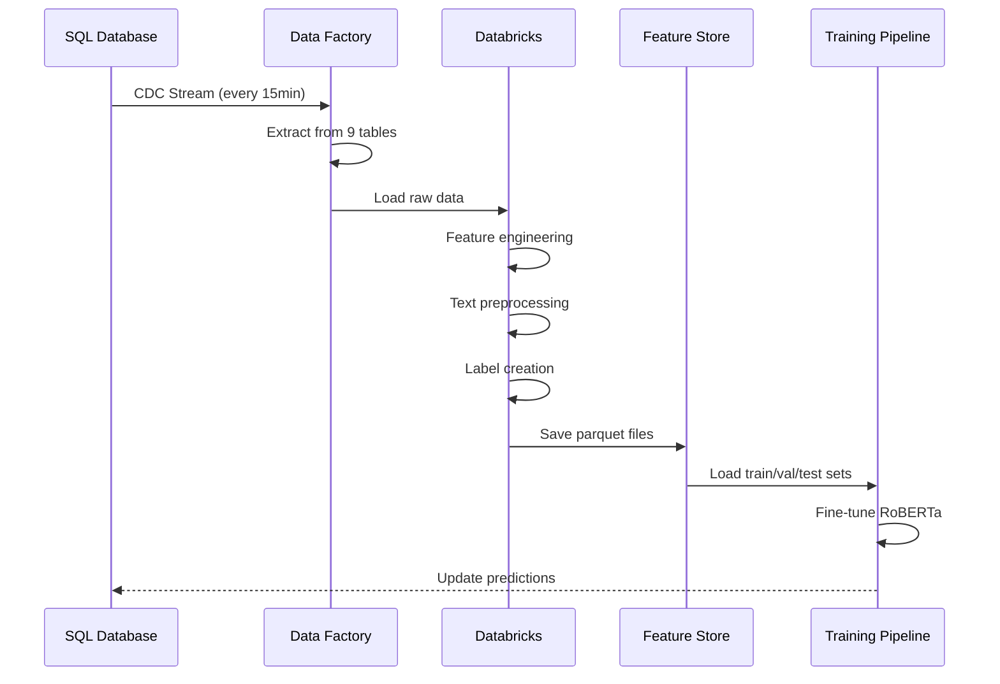

### Feature Engineering Process

**Features Created:**

| Feature Type | Examples | Transformation |
|--------------|----------|----------------|
| **Numerical** | `income_to_loan`, `age`, `property_age` | Ratio calculations |
| **Categorical** | `credit_tier`, `ltv_category`, `dti_category` | Binning |
| **Text** | `combined_text` | Concatenation + tokenization |
| **Flags** | `high_risk_flag`, `meets_criteria` | Boolean logic |

---

## 🧠 Model Training

### Training Workflow

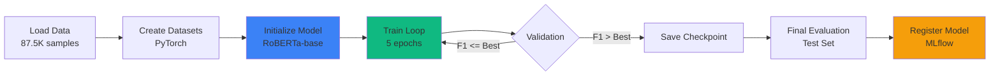


### Model Performance

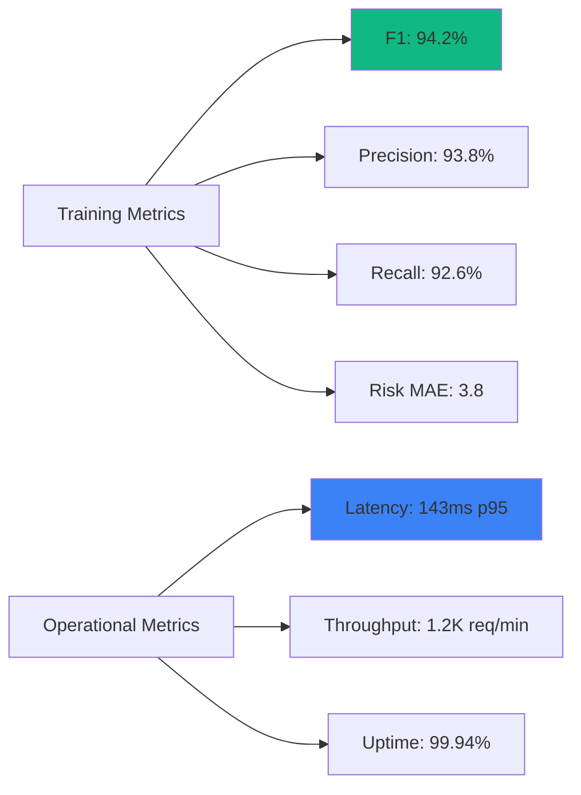

---


### API Endpoints

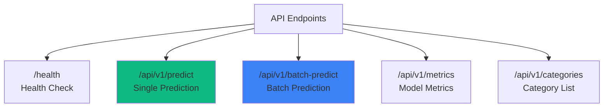

---
### API Summary


| Endpoint | Method | Description | Auth Required |
|----------|--------|-------------|---------------|
| `/health` | GET | Health check | ❌ |
| `/api/v1/predict` | POST | Single prediction | ✅ |
| `/api/v1/batch-predict` | POST | Batch predictions | ✅ |
| `/api/v1/metrics` | GET | Model performance | ✅ |
| `/api/v1/categories` | GET | Denial categories | ❌ |
| `/docs` | GET | Interactive API docs | ❌ |

---

## 🚢 Deployment

### Docker Build

### Kubernetes Deployment

### Deploy Redis

### Check status

### Deployment Flow

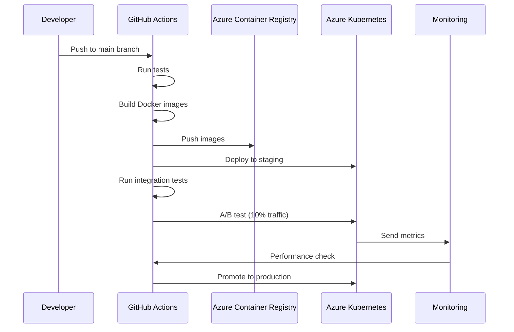

### Environment Configuration

---

## 📈 Monitoring

### Monitoring Stack

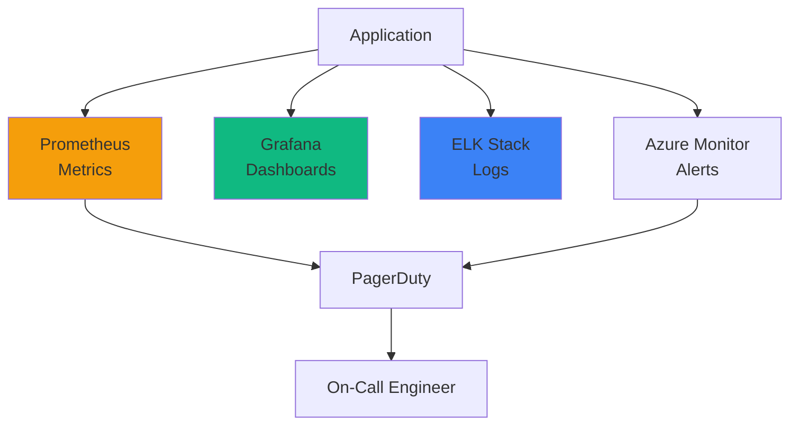

### Key Metrics

**Model Metrics:**
- F1-score by category
- Confidence distribution
- Prediction volume
- Error rate

**System Metrics:**
- Latency (p50/p95/p99)
- Throughput (requests/sec)
- CPU/Memory utilization
- Error rates

**Business Metrics:**
- Applications processed/day
- Cost per prediction
- Processing time reduction
- Officer satisfaction (NPS)

---

## 🔧 Development

### Development Workflow

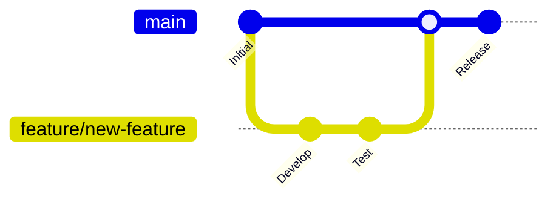


### Team
- **Product Owner:** Jane Smith (jane.smith@example.com)
- **Tech Lead:** John Doe (john.doe@example.com)
- **ML Engineering:** ML Team (ml-team@example.com)
- **DevOps:** Platform Team (platform@example.com)

---

## 🙏 Acknowledgments

- RoBERTa model from [Hugging Face](https://huggingface.co/roberta-base)
- Financial services dataset from internal systems
- Open-source contributors and maintainers

---

## 📊 Project Status


**Last Updated:** December 26, 2025

---

<div align="center">
  <strong>Built with ❤️ by the FinTune AI Team</strong>
  <br/>
  <sub>Transforming financial services with AI</sub>
</div>

