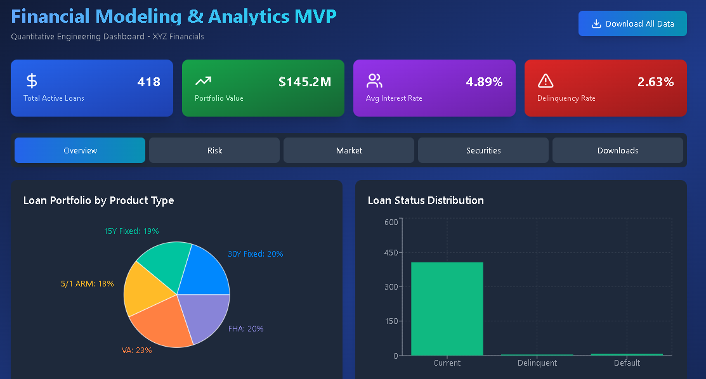
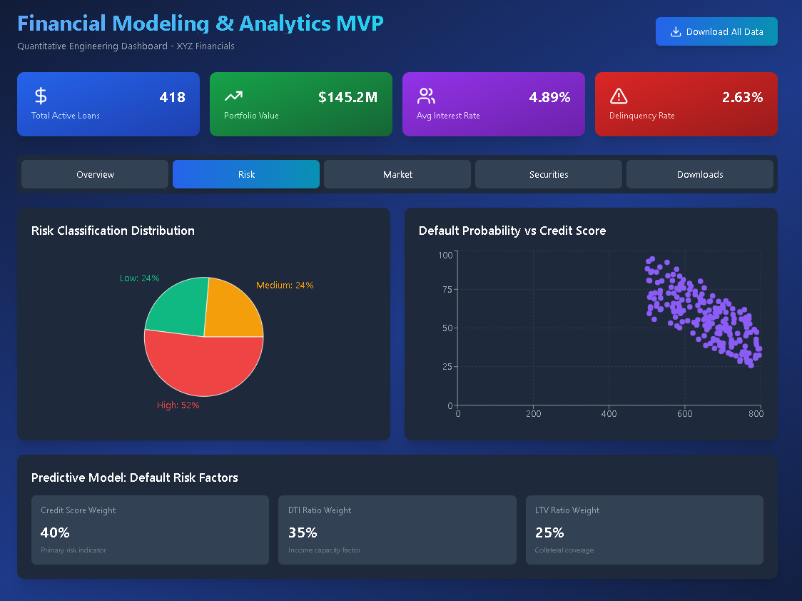
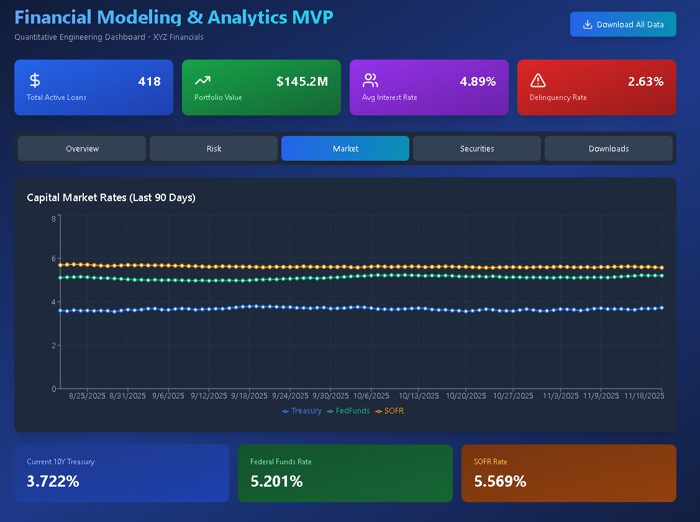
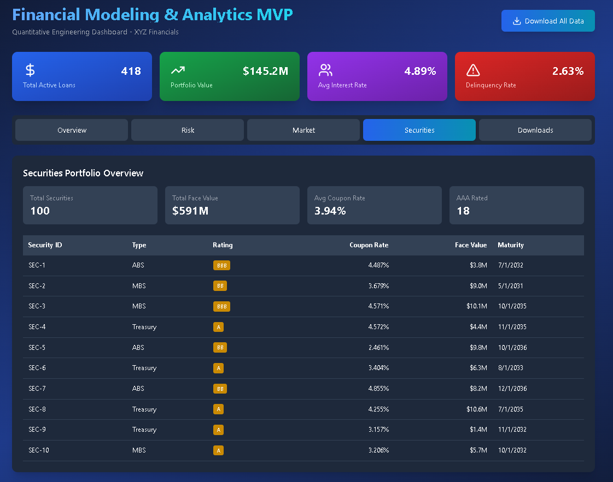

# 📊 Financial Quantitative Engineering - Modeling & Analytics MVP — XYZ Financials

This repository contains the MVP implementation of a financial modeling and predictive analytics platform for XYZ Financials. It supports loan portfolio analysis, market rate tracking, risk classification, and securities performance — all built for quantitative engineering and decision support.

---

## 🧠 Overview

This MVP includes:
- Real-time loan portfolio metrics
- Predictive modeling for default risk
- Capital market rate analysis
- Securities portfolio breakdown
- Downloadable reports and data exports

---

## 📈 Dashboard Views

### 🔹 Overview Tab
- **Total Active Loans**: 418  
- **Portfolio Value**: $145.2M  
- **Average Interest Rate**: 4.89%  
- **Delinquency Rate**: 2.63%

	

#### Loan Portfolio by Product Type
- 30Y Fixed: 20%  
- FHA: 20%  
- VA: 23%  
- 5/1 ARM: 18%  
- 15Y Fixed: 19%

#### Loan Status Distribution
- Current: ~400  
- Delinquent: Low  
- Default: Low

---

### 🔹 Risk Tab
#### Risk Classification Distribution
- Low Risk: 24%  
- Medium Risk: 24%  
- High Risk: 52%

	

#### Default Probability vs Credit Score
- Negative correlation observed between credit score and default probability

#### Predictive Model Weights
- Credit Score: 40%  
- DTI Ratio: 35%  
- LTV Ratio: 25%

---

### 🔹 Market Tab
#### Capital Market Rates (Last 90 Days)
- **Treasury 10Y** (blue)
- **Fed Funds Rate** (green)
- **SOFR** (orange)

	

#### Current Rates
- Treasury 10Y: 3.722%  
- Fed Funds Rate: 5.201%  
- SOFR: 5.569%

---

### 🔹 Securities Tab
#### Securities Portfolio Overview
- **Total Securities**: 100  
- **Total Face Value**: $591M  
- **Average Coupon Rate**: 3.94%  
- **AAA Rated**: 18

| Security ID | Type     | Rating | Coupon Rate | Face Value | Maturity   |
|-------------|----------|--------|--------------|-------------|-------------|
| SEC-1       | ABS      | BBB    | 4.487%       | $3.8M       | 7/1/2032    |
| SEC-2       | MBS      | BB     | 3.679%       | $9.0M       | 5/1/2031    |
| SEC-3       | MBS      | BBB    | 4.571%       | $10.1M      | 10/1/2035   |
| SEC-4       | Treasury | A      | 4.572%       | $4.4M       | 11/1/2035   |
| SEC-5       | ABS      | BB     | 2.461%       | $9.8M       | 10/1/2036   |
| SEC-6       | Treasury | A      | 3.404%       | $6.3M       | 8/1/2033    |
| SEC-7       | ABS      | BB     | 4.855%       | $8.2M       | 12/1/2036   |
| SEC-8       | Treasury | A      | 4.255%       | $10.6M      | 7/1/2035    |
| SEC-9       | Treasury | A      | 3.157%       | $1.4M       | 11/1/2032   |
| SEC-10      | MBS      | A      | 3.206%       | $5.7M       | 10/1/2032   |

---

## 🛠️ Technologies Used
- Python (Pandas, Scikit-learn, Streamlit)
- SQL Server (schema-driven modeling)
- Plotly Dash / Streamlit for dashboarding
- Markdown for documentation
- GitHub for version control

---
---

