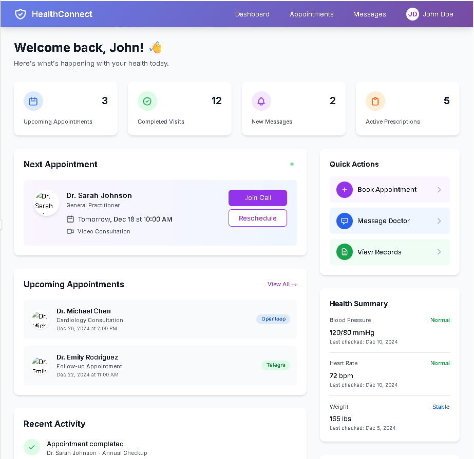
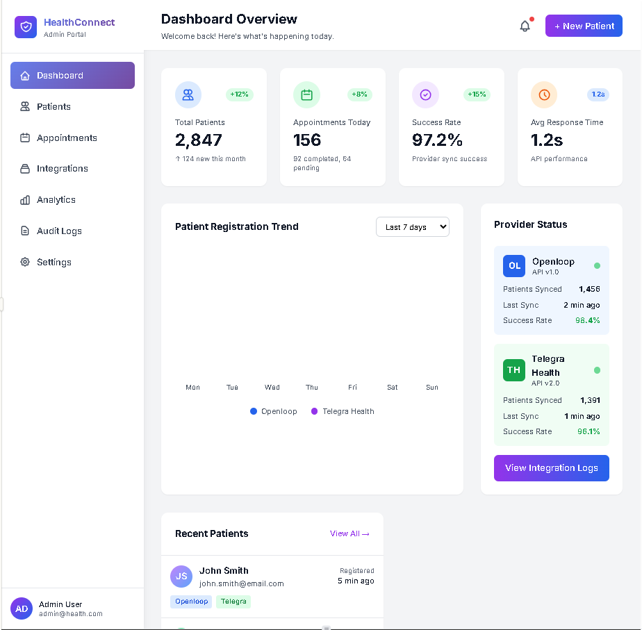

# HealthConnect - Patient Portal Integration MVP

## 🏥 Overview

A production-ready FastAPI backend service that integrates your existing website backend with telemedicine patient portals (**Openloop** and **Telegra Health**). This MVP enables secure patient registration, appointment management, and telemedicine session creation with full HIPAA compliance.


---
## 🎯 Usage

### User Interface Dashboard


### Web Dashboard

---

## ✨ Features

- **Patient Management**
  - Patient registration with dual-provider sync
  - Secure PHI (Protected Health Information) storage
  - Profile management and updates
  
- **Provider Integration**
  - Openloop API integration
  - Telegra Health API integration
  - Automatic sync and fallback mechanisms
  
- **Appointment Management**
  - Create and retrieve appointments
  - Multi-provider appointment support
  - Status tracking and updates
  
- **Telemedicine Sessions**
  - Session creation and management
  - Video session URL generation
  - Session status tracking
  
- **Security & Compliance**
  - HIPAA-compliant data handling
  - PHI encryption at rest
  - Comprehensive audit logging
  - JWT-based authentication
  - HTTPS/TLS encryption

---

## 🚀 Quick Start

### Prerequisites

- Python 3.11+
- PostgreSQL 15+ (or SQLite for development)
- API credentials for Openloop and Telegra Health


## 🔌 API Endpoints
### Patient Management

```http
POST   /api/v1/patient/register          # Register new patient
GET    /api/v1/patient/{id}              # Get patient details
PATCH  /api/v1/patient/{id}              # Update patient
DELETE /api/v1/patient/{id}              # Delete patient
GET    /api/v1/patient/{id}/integration-status  # Check sync status
POST   /api/v1/patient/{id}/sync         # Force sync with providers
```

### Appointments

```http
GET    /api/v1/appointments/{patient_id}           # Get appointments
POST   /api/v1/appointments/{patient_id}           # Create appointment
PATCH  /api/v1/appointments/{appointment_id}       # Update appointment
DELETE /api/v1/appointments/{appointment_id}       # Cancel appointment
```

### Telemedicine Sessions

```http
POST   /api/v1/telemedicine/session      # Create session
GET    /api/v1/telemedicine/session/{id} # Get session details
POST   /api/v1/telemedicine/session/{id}/start   # Start session
POST   /api/v1/telemedicine/session/{id}/end     # End session
```

## 🔐 Authentication

The API uses JWT (JSON Web Tokens) for authentication:

## 📊 Example Usage

### Register a Patient
### Create an Appointment

---

## 🧪 Testing


## 🚢 Deployment

### Docker


### Cloud Platforms

- **Render**: See `deployment/render.yaml`
- **Railway**: See `deployment/railway.json`
- **AWS/Azure**: See `deployment/kubernetes/`

## 🔒 Security & HIPAA Compliance

- ✅ PHI encryption at rest
- ✅ TLS/SSL encryption in transit
- ✅ Comprehensive audit logging
- ✅ Access controls and authentication
- ✅ Secure credential management
- ✅ Regular security headers
- ✅ Rate limiting
- ✅ Input validation


## 📖 Documentation


## 📊 Status


---

**Built with ❤️ for better healthcare access**

---
