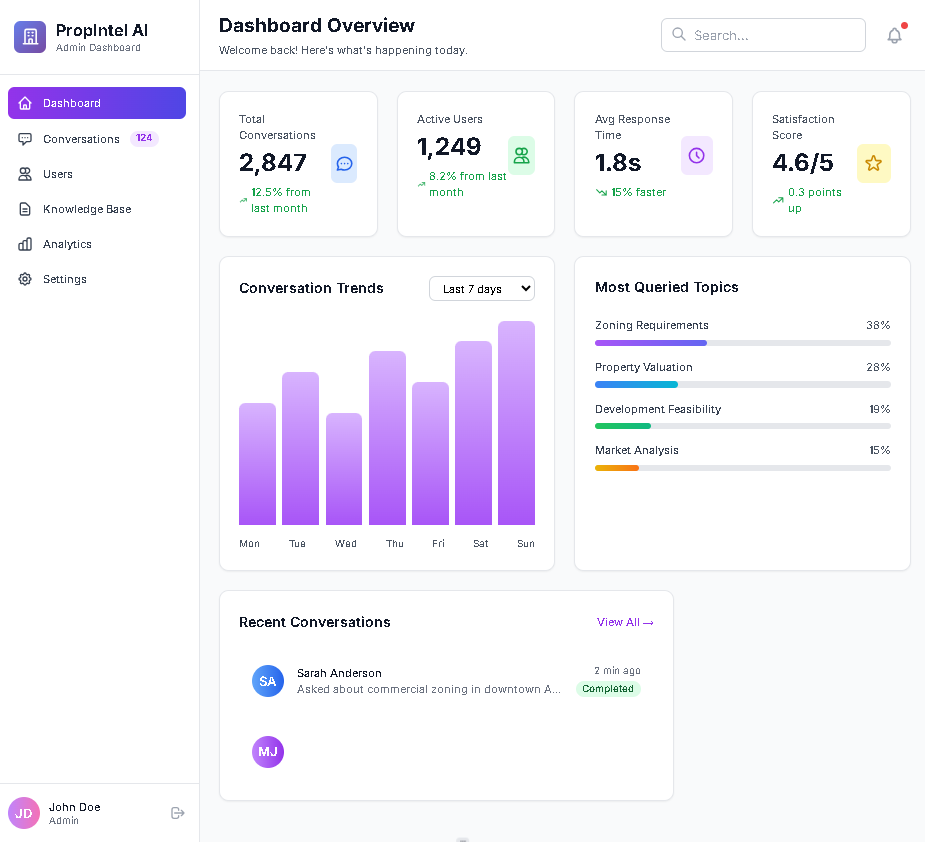
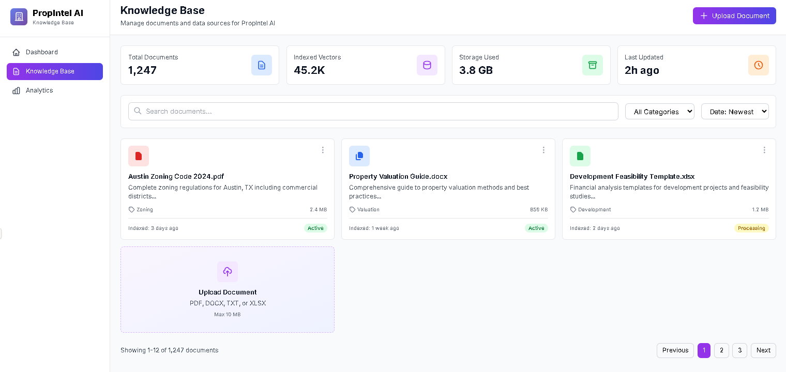
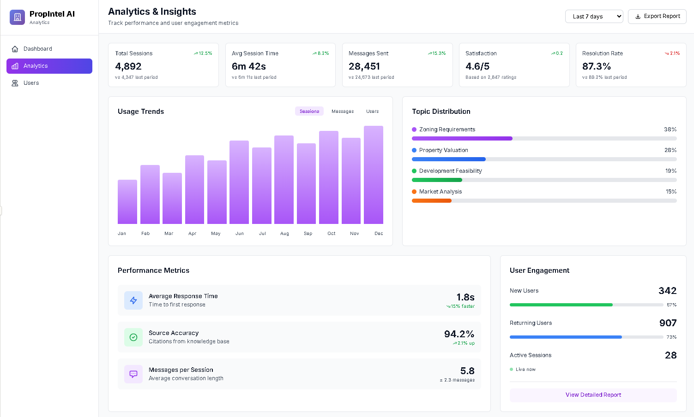
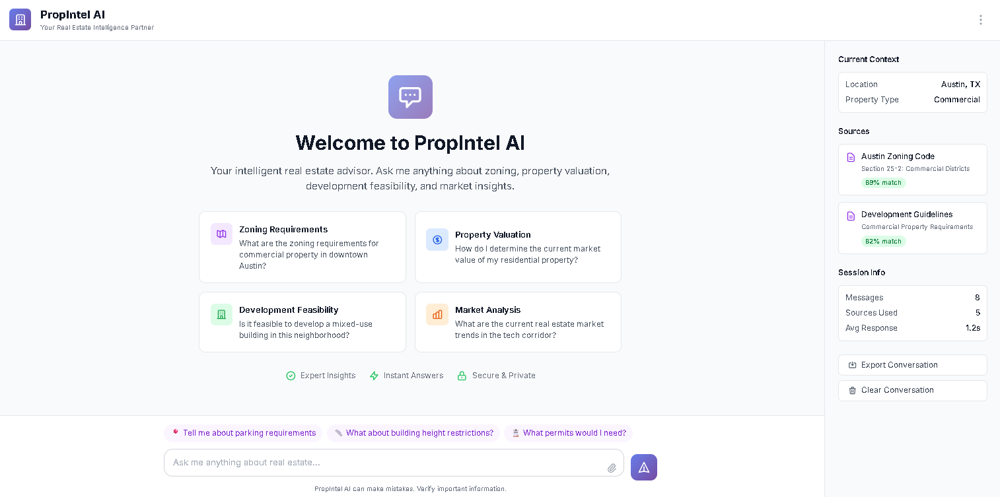
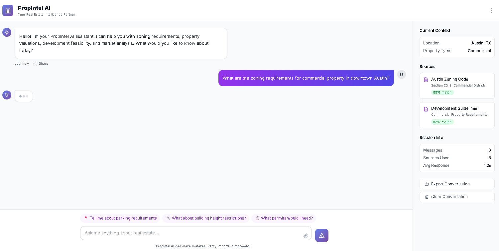

# PropIntel AI -RAG - Real Estate Chatbot MVP

PropIntel AI - A conversational AI platform for real estate professionals, built with RAG (Retrieval-Augmented Generation) architecture, vector database integration, and domain-specific expertise in zoning, property valuation, and development logic.

## 🎯 Overview

This chatbot goes beyond simple retrieval by:
- Asking intelligent follow-up questions to clarify user intent
- Simulating expert insight in real estate domains
- Maintaining context across multi-turn conversations
- Providing accurate, source-backed responses using RAG
- Supporting extensibility for fine-tuning and custom datasets

## User Interface

#### PropIntel AI Admin Dashboard










## 🏗️ Architecture

```
Frontend (React) → Backend API (Express.js) → LLM Provider (OpenAI/Claude)
                                            ↓
                                    Vector Database (Pinecone)
                                            ↓
                                    Knowledge Base (Real Estate Data)
```
---

## 📋 Prerequisites

- Node.js 18+ or Python 3.9+
- npm or yarn
- OpenAI API key or Anthropic API key
- Pinecone account (free tier available)
- 2GB RAM minimum
- Git


## 🔌 API Endpoints

- POST /api/chat/message
- GET /api/chat/history/:conversationId
- POST /api/chat/feedback
- GET /api/health


## 🔧 Configuration Options
-  LLM Provider Selection
-  Vector Database Configuration
-  Prompt Customization

---

## 🧪 Testing

-  📊 Monitoring and Logging

---
## 🚢 Deployment

-  Docker Deployment

---

## 🔐 Security Considerations

- API keys stored in environment variables
- JWT-based authentication for API endpoints
- Rate limiting enabled (100 requests/15min per IP)
- Input sanitization and validation
- CORS configured for allowed origins
- Secrets never logged or exposed


---

**Version:** 1.0.0  
**Last Updated:** December 2025  

---
