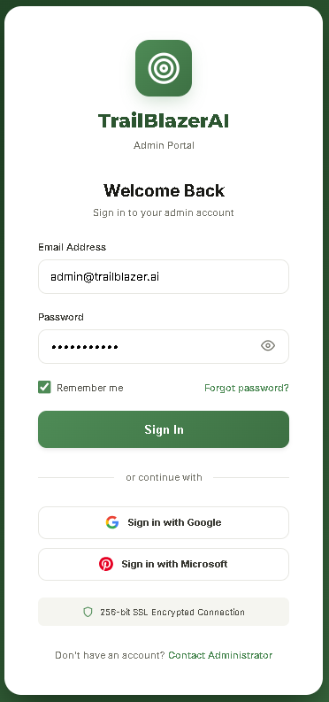
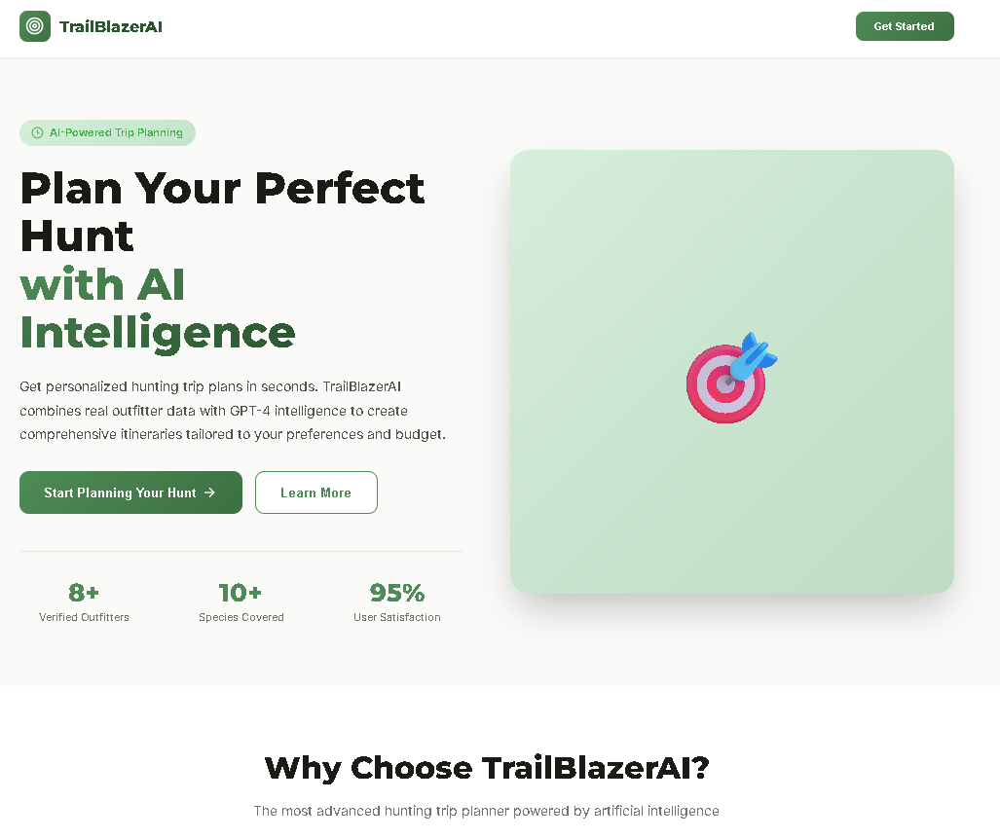
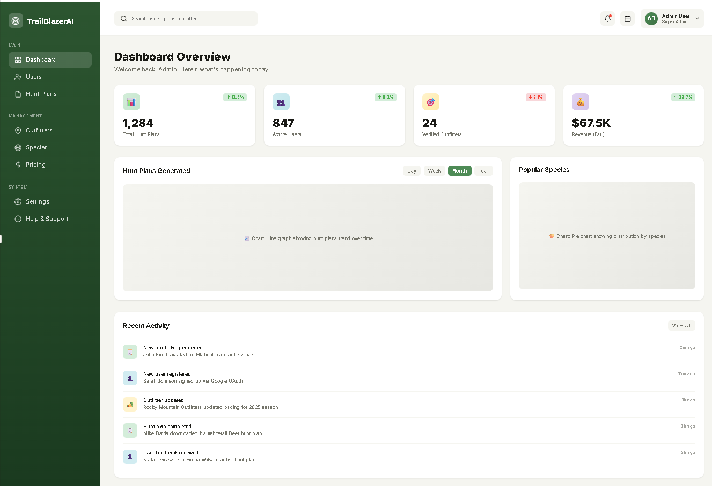
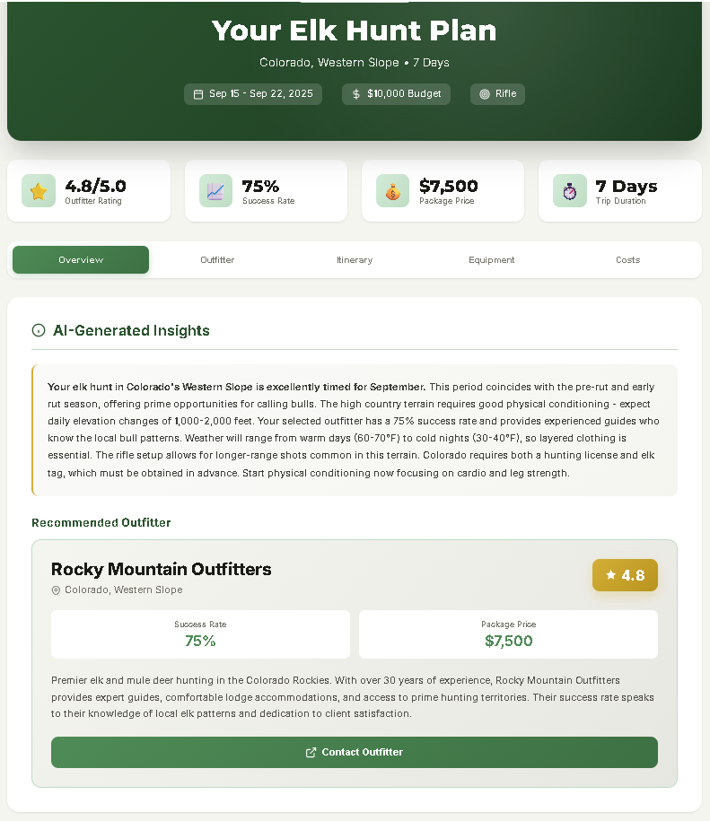

# 🏹 TrailBlazer AI

**AI-Powered Hunting Trip Planner** - Generate custom hunt plans using OpenAI and real outfitter data.

---

## 📋 Table of Contents

- [Overview](#overview)
- [Features](#features)
- [Tech Stack](#tech-stack)
- [Getting Started](#getting-started)
- [Usage](#usage)
- [API Documentation](#api-documentation)
- [Deployment](#deployment)
- [Testing](#testing)

---

## 🎯 Overview

TrailBlazerAI is an MVP platform that helps hunters plan their trips by combining AI-generated itineraries with real outfitter pricing data. Users provide their hunting preferences (species, budget, location, weapon, dates), and the system generates a comprehensive hunt plan including outfitter recommendations, daily itineraries, equipment checklists, and cost breakdowns.

### Key Capabilities

- **AI-Powered Planning**: Uses OpenAI GPT-4 to generate personalized hunt plans
- **Real Outfitter Data**: Integrates actual outfitter pricing and availability
- **Comprehensive Itineraries**: Day-by-day schedules with activities
- **Equipment Checklists**: Customized gear lists based on species and weapon
- **Cost Estimation**: Detailed breakdown of trip expenses
- **Multi-Country Support**: Hunting destinations across North America, Africa, and more

---

## ✨ Features

### For Hunters
- 🎯 Species-specific hunt planning (Elk, Deer, Moose, African game, etc.)
- 💰 Budget-based outfitter matching
- 📅 Date-flexible trip scheduling
- 🏹 Weapon-specific recommendations (Rifle, Bow, Muzzleloader)
- 📝 Printable hunt plans with all details

### For Developers
- 🚀 FastAPI backend with async support
- ⚡ React frontend with modern UI
- 🗄️ SQLAlchemy ORM with PostgreSQL/SQLite
- 🔐 Environment-based configuration
- 🐳 Docker containerization
- 📊 Comprehensive test coverage

---

## 🛠️ Tech Stack

### Backend
- **Framework**: FastAPI 0.104
- **Language**: Python 3.11+
- **Database**: PostgreSQL 15 (production), SQLite (development)
- **ORM**: SQLAlchemy 2.0
- **AI**: OpenAI API (GPT-4)

### Frontend
- **Framework**: React 18
- **Styling**: CSS3 with custom design system
- **HTTP Client**: Fetch API

### DevOps
- **Containerization**: Docker & Docker Compose
- **Deployment**: Render, Railway, AWS, Azure compatible
- **Testing**: Pytest, Jest
- **CI/CD**: GitHub Actions ready

---

## 🚀 Getting Started

### Prerequisites

- Python 3.11 or higher
- Node.js 18 or higher
- PostgreSQL 15 (for production) or SQLite (for development)
- OpenAI API key ([Get one here](https://platform.openai.com/api-keys))
- Git

---

## 📖 Usage

### 1. Login Screen

Access the platform by logging in with your credentials. New users can sign up for an account.

### 2. Landing Page

Start your hunt planning journey by visiting the landing page. Click "Start Planning" to begin.

### 3. Dashboard Walkthrough

### 4. Submit Hunting Preferences

Navigate to the web interface and fill out the form:

- **Species**: Select your target species (e.g., Elk, Whitetail Deer)
- **Budget**: Enter your total budget in USD
- **Country**: Choose your destination country
- **Weapon**: Select your weapon type (Rifle, Bow, Muzzleloader)
- **Dates**: Pick your preferred start and end dates
- **Group Size**: Number of hunters in your party
- **Accommodation**: Lodge, Camp, or Backcountry

### 5. Generate Hunt Plan

Click "Generate Hunt Plan" and wait while the AI processes your request:

1. System searches for matching outfitters
2. Filters by budget and availability
3. AI generates personalized itinerary
4. Combines with real pricing data

### 6. Review Your Plan

Explore your custom hunt plan across multiple tabs:

- **Overview**: AI insights and preparation tips
- **Outfitter**: Detailed outfitter information and ratings
- **Itinerary**: Day-by-day schedule
- **Equipment**: Customized gear checklist
- **Costs**: Detailed expense breakdown

### 7. Print or Save

- Print your hunt plan for offline reference
- Start a new search to compare options

---

## 📡 API Documentation

### Interactive API Docs

FastAPI provides automatic interactive documentation:

- **Swagger UI**: http://localhost:8000/docs
- **ReDoc**: http://localhost:8000/redoc

---

## 🌐 Deployment

### Render.com (Recommended)

### Railway

### Docker Production

### AWS EC2

---

## 🧪 Testing

### Backend Tests

### Frontend Tests

### Manual API Testing

---

**Happy Hunting! 🎯🏹**

---
