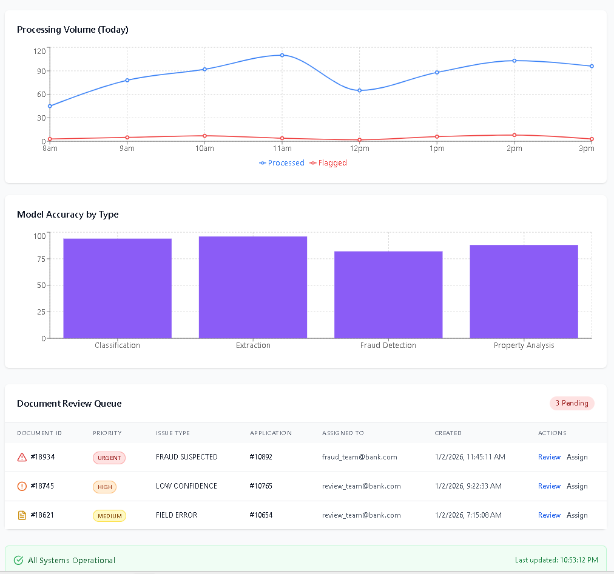
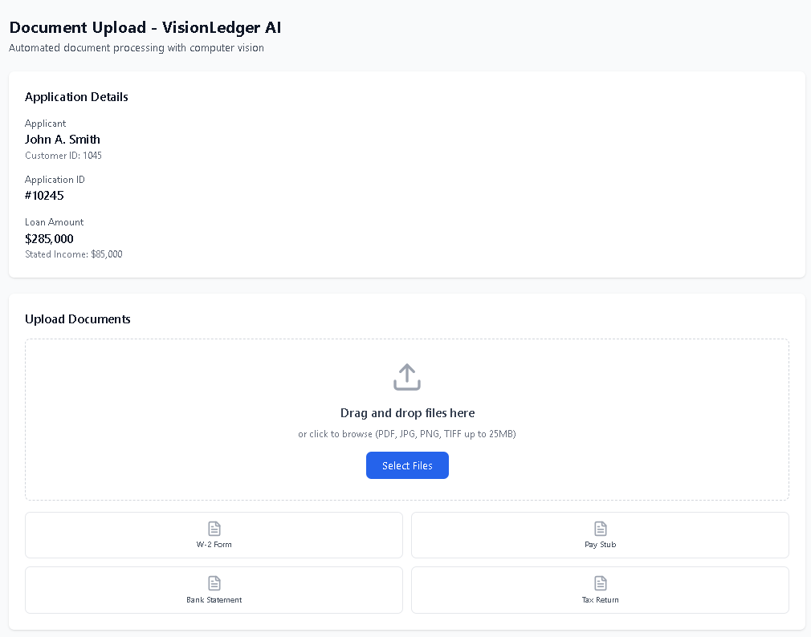
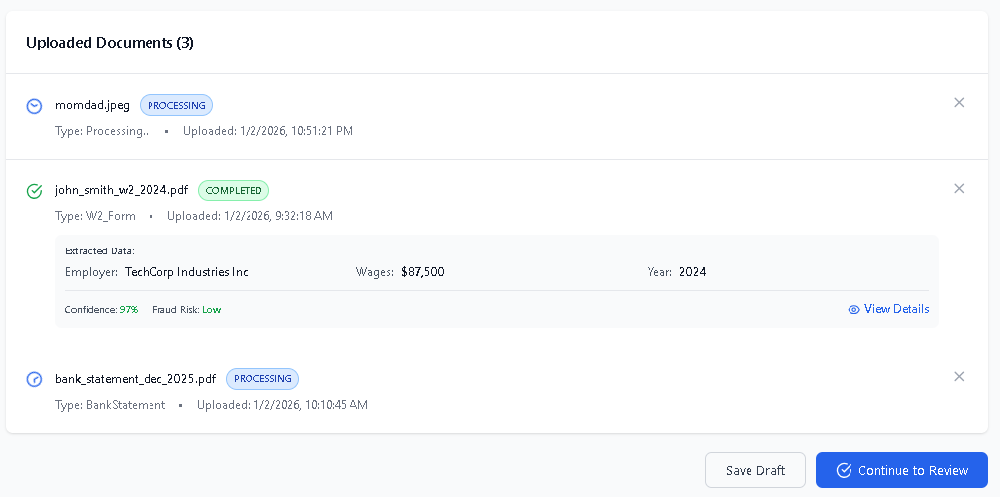

# VisionLedger AI - Computer Vision intelligence 

### Vision Statement
Transform financial document processing through computer vision, reducing loan application cycle times by 70% while improving fraud detection accuracy and maintaining 99.9% regulatory compliance.

### Business Objectives
1. **Cost Reduction**: Reduce document processing costs from $150 to $15 per application
2. **Speed**: Decrease application processing time from 5 days to <24 hours
3. **Accuracy**: Achieve 95%+ field extraction accuracy, 80%+ fraud detection rate
4. **Scale**: Handle 50,000+ documents/month by Month 6
5. **Compliance**: Maintain SOC 2 Type II, GLBA, CFPB compliance

### Problem Statement

#### Current Pain Points
1. **Manual Document Review Bottleneck**
   - Loan officers spend 4-6 hours per application reviewing documents
   - High error rate (8-12%) in manual data entry
   - Processing delays cause 15-20% application abandonment

2. **Fraud Exposure**
   - Current fraud detection catches only 40-50% of tampered documents
   - Annual losses: $2.5M from fraudulent applications
   - Reactive rather than proactive detection

3. **Property Valuation Inaccuracy**
   - Reliance on outdated appraisal reports
   - 15-20% variance between estimated and actual property values
   - No visual verification of property condition

4. **Compliance Risk**
   - Manual audit trails are incomplete
   - Document retention inconsistencies
   - Difficulty demonstrating fair lending practices
	
## **ML Preprocessing Pipeline**

**Capabilities**:
- Automatic skew detection and correction
- Denoising and contrast enhancement
- PaddleOCR integration
- Error Level Analysis for fraud detection
- JPEG artifact analysis
- Metadata consistency verification

---

## **Admin Dashboard Interface** 

**Features**:
- Real-time KPI cards (documents processed, avg time, fraud rate)
- Processing volume chart (hourly breakdown)
- Model accuracy visualization
- Document review queue with priority sorting
- System status monitoring
- Interactive data tables

**Metrics Displayed**:
- Documents processed (24h): 1,247
- Avg processing time: 1.8s
- Fraud detection rate: 82%
- System accuracy: 96%




---

## **Loan Officer Upload Interface** 

**Features**:
- Drag-and-drop document upload
- Real-time processing status updates
- Extracted data preview
- Confidence scores and fraud risk indicators
- Application context display
- Document type suggestions

**User Experience**:
- Intuitive file upload (PDF, JPG, PNG, TIFF)
- Live status updates (Processing → Completed)
- Extracted field visualization
- One-click document removal





---

## Technical Architecture

### System Components
```
┌─────────────────┐
│   Web/Mobile    │  ← Loan Officer Interface
│    Frontend     │
└────────┬────────┘
         │ HTTPS
┌────────▼────────┐
│   API Gateway   │  ← Auth, Rate Limiting
│   (AWS ALB)     │
└────────┬────────┘
         │
    ┌────┴────┐
    │         │
┌───▼──┐  ┌──▼────┐
│ Auth │  │ CV    │  ← Core Processing
│ Svc  │  │ API   │
└──────┘  └───┬───┘
              │
      ┌───────┼───────┐
      │       │       │
  ┌───▼──┐ ┌─▼──┐ ┌──▼───┐
  │Class │ │OCR │ │Fraud │  ← ML Models
  │ifier │ │Eng │ │ Det  │
  └──────┘ └────┘ └──────┘
      │       │       │
      └───────┼───────┘
              │
      ┌───────▼───────┐
      │  PostgreSQL   │  ← Schema Tables
      │   + Vector    │
      │      DB       │
      └───────────────┘
```

### Technology Stack
- **Backend**: Python 3.11, FastAPI
- **ML Framework**: PyTorch 2.1, Transformers 4.35
- **OCR**: PaddleOCR 2.7
- **Storage**: AWS S3 (images), PostgreSQL 15 (metadata)
- **Compute**: AWS Lambda (preprocessing), SageMaker (model inference)
- **Queue**: Redis 7.2 (review queue)
- **Monitoring**: CloudWatch, Prometheus

---


**Document Version History**:
- v1.0 (2026-01-02): Initial PRD approved


---
---
