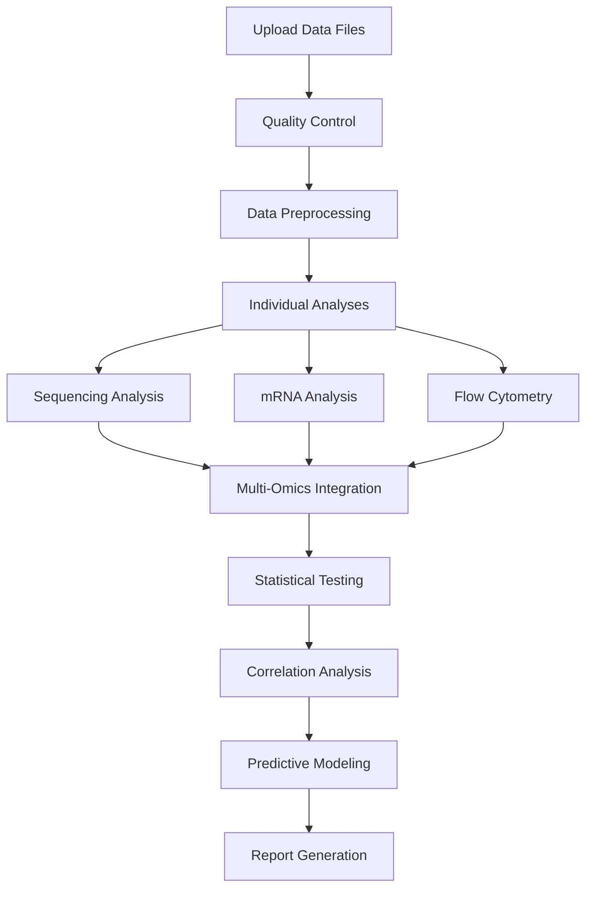

# Bioinformatics Analysis Platform MVP

[](https://reactjs.org/)
[](https://github.com/yourusername/bioinformatics-platform)

> Integrated multi-omics analysis platform for correlating sequencing data, mRNA expression, and flow cytometry with patient outcomes in oncology and immunology research.

## 🔬 Overview

The Bioinformatics Analysis Platform is a comprehensive MVP designed to help researchers analyze and correlate genomic, transcriptomic, and immunological data with clinical outcomes. Built for oncology and immunology research, this platform streamlines the workflow from raw data upload through statistical analysis to publication-ready report generation.

### Key Features

- **Multi-Omics Integration**: Analyze NGS/WES/RNA-seq, microarray, and flow cytometry data in one platform
- **Patient-Drug Correlation Analysis**: Identify relationships between molecular features and treatment responses
- **Outcome Prediction**: Machine learning models for survival and response prediction
- **Automated Statistical Analysis**: Built-in statistical tests, survival analysis, and multiple testing correction
- **Publication-Ready Reports**: Export to Excel, PowerPoint, GraphPad Prism, and SPSS formats
- **Interactive Visualization**: Dynamic charts, heatmaps, survival curves, and volcano plots

## 📋 Table of Contents

- [Features](#features)
- [Demo](#demo)
- [Usage](#usage)
- [Data Format Requirements](#data-format-requirements)
- [Analysis Pipeline](#analysis-pipeline)
- [Tools & Technologies](#tools--technologies)

## ✨ Features

### 🧬 Sequencing Data Analysis
- Variant calling and annotation
- Mutation frequency analysis
- Tumor mutational burden (TMB) calculation
- Oncogenic mutation detection
- Patient stratification by mutation profile
- Survival correlation with genomic alterations

### 📊 mRNA Expression Analysis
- Differential gene expression (DEG) analysis
- Gene set enrichment analysis (GSEA)
- Pathway analysis (KEGG, Reactome)
- Drug response prediction
- Biomarker identification
- Gene signature development

### 🔬 Flow Cytometry Analysis
- Immune cell population quantification
- Activation marker profiling
- CD4/CD8 ratio calculation
- Regulatory T cell analysis
- NK cell functional assessment
- Outcome prediction based on immune profiles

### 📈 Integrated Correlation Analysis
- Multi-omics data integration
- Patient-drug characteristic correlation
- Treatment response prediction
- Survival analysis (Kaplan-Meier, Cox regression)
- Statistical significance testing
- Machine learning predictions

### 📄 Report Generation
- Automated comprehensive reports
- Publication-quality figures
- Statistical summaries with p-values
- Export to multiple formats (PDF, PowerPoint, Excel)
- Compatible with GraphPad Prism and SPSS

## 🎬 Demo
- Bioinformatics Analysis Platform MVP Dashboard <br/>
  <br/>

- Bioinformatics Analysis Platform MVP DB-Data Upload <br/>
<br/>

- Sequencing Analysis <br/>
<br/>

- mRNA Analysis<br/>
<br/>

- Flow Cytometry<br/>
<br/>

- Integrated Results Corelations<br/>

<br/>


## 📖 Usage
### 1. Data Upload
Upload your data files in supported formats:

- **Sequencing Data**: VCF, BAM, FASTQ, CSV
- **mRNA Expression**: CSV, CEL, TXT, XLSX
- **Flow Cytometry**: FCS, CSV (FlowJo export)

```bash
# Example file structure
data/
├── sequencing/
│   ├── patient_variants.vcf
│   └── mutation_data.csv
├── expression/
│   ├── gene_expression_matrix.csv
│   └── clinical_annotations.csv
└── flow/
    ├── immune_populations.csv
    └── activation_markers.fcs
```

### 2. Run Analysis

### 3. View Results

Navigate through analysis modules:
- Sequencing Analysis → Patient correlations
- mRNA Analysis → Drug characteristics
- Flow Cytometry → Outcome predictions
- Integrated Results → Multi-omics correlations

### 4. Export Reports

Generate publication-ready reports:
- PowerPoint presentation
- Excel workbook with all data
- GraphPad Prism compatible files
- SPSS data files
- R/Python analysis scripts

## 📁 Data Format Requirements

### Sequencing Data Format (CSV)

```csv
Patient_ID,Gene,Chromosome,Position,Reference,Alternate,Mutation_Type,VAF,Depth,Consequence,TMB,Age,Gender,Stage,Treatment,Response,Survival_Months,Status
PT001,TP53,chr17,7577538,C,T,Missense,0.45,150,Pathogenic,12.3,65,M,III,Drug_A,PR,18,Alive
PT002,KRAS,chr12,25398284,C,A,Missense,0.38,120,Pathogenic,8.7,58,F,IV,Drug_B,PD,9,Deceased
```

**Required Columns:**
- Patient_ID (unique identifier)
- Gene (HUGO gene symbol)
- Clinical data: Age, Gender, Stage, Treatment, Response, Survival_Months, Status

### mRNA Expression Format (CSV)

```csv
Gene_Symbol,PT001,PT002,PT003,...
BCL2,6.234,8.456,5.123,...
TP53,4.567,3.234,7.890,...
KRAS,5.678,6.789,4.567,...
```

**Plus Clinical Annotations:**
```csv
Patient_ID,Age,Gender,Stage,Treatment,Drug_Response,Survival_Months,Status
PT001,65,M,III,Drug_A,Responder,18,Alive
```

### Flow Cytometry Format (CSV)

```csv
Patient_ID,Sample_Date,CD45+,CD3+,CD4+,CD8+,CD4_CD8_Ratio,CD4_CD25_FoxP3_Treg,CD8_Effector,NK_Cells_CD56+,B_Cells_CD19+,PD1+_CD8,Ki67+_CD8,Age,Gender,Stage,Treatment,Response,Survival_Months,Status
PT001,2024-01-15,88.5,72.3,32.5,22.1,1.47,6.8,24.5,14.2,8.5,35.6,18.3,65,M,III,Drug_A,PR,18,Alive
```

**Required Columns:**
- Patient_ID
- Cell populations (percentages)
- Clinical outcomes

## 🔄 Analysis Pipeline

### Step-by-Step Workflow



### Analysis Methods

#### Statistical Tests
- Pearson/Spearman correlation
- Student's t-test / Wilcoxon test
- Chi-square test
- ANOVA / Kruskal-Wallis
- Kaplan-Meier survival analysis
- Cox proportional hazards regression
- Multiple testing correction (FDR, Bonferroni)

#### Machine Learning
- Logistic regression
- Random forest classification
- Support vector machines (SVM)
- K-nearest neighbors (KNN)
- Cross-validation (10-fold)
- Feature importance ranking

## 🛠️ Tools & Technologies

### Core Technologies
- **Frontend**: React 18.x, Tailwind CSS
- **Icons**: Lucide React
- **Charting**: Recharts, D3.js, Plotly
- **State Management**: React Hooks

### Bioinformatics Stack
- **R/Bioconductor**: DESeq2, edgeR, limma, survival, ComplexHeatmap
- **Python**: pandas, NumPy, scikit-learn, Biopython
- **Analysis Tools**: GATK, STAR, BWA, FlowJo, GraphPad Prism, SPSS

### Compatible Data Sources
- Illumina sequencing platforms
- Affymetrix/Agilent microarrays
- BD/Beckman flow cytometers
- Clinical trial databases
- Public repositories (GEO, TCGA, dbGaP)


### Available Sample Datasets

1. **Sequencing Data** (50 patients, 12 cancer genes)
   - NGS/WES/RNA-seq variants
   - Clinical annotations
   - Treatment outcomes

2. **mRNA Expression** (35 genes, 50 samples)
   - Normalized expression values
   - Drug response data
   - Pathway annotations

3. **Flow Cytometry** (50 samples, 14 populations)
   - Immune cell percentages
   - Activation markers
   - Outcome correlations

4. **VCF Format** (Standard variant call format)
   - GRCh38 reference
   - Quality scores
   - Gene annotations

5. **Clinical Data** (Comprehensive patient information)
   - Demographics
   - Treatment history
   - Survival data


## 📊 Performance

- Handles datasets with up to 10,000 samples
- Processes 50,000+ variants efficiently
- Real-time visualization updates
- Optimized for large gene expression matrices

## 🔒 Security & Privacy

- All data processing happens client-side
- No data is sent to external servers
- HIPAA compliance considerations built-in
- Secure file handling
- No persistent storage of PHI


