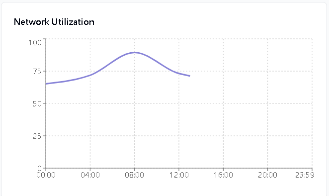

# 🚀 Crypto Analytics Dashboard

A comprehensive real-time analytics platform for MEV extraction, liquidity health monitoring, validator performance tracking, and network health analysis.

  

## 📊 Overview

The Crypto Analytics Dashboard provides institutional-grade insights for crypto trading firms, DeFi protocols, and investment teams. It combines real-time blockchain data with advanced analytics to deliver actionable intelligence across MEV strategies, liquidity management, and validator operations.

### ✨ Key Features

- **Real-time MEV Monitoring** - Track bot performance, strategy profitability, and market opportunities
- **Liquidity Health Analysis** - Monitor pool depth, volatility, and trading efficiency
- **Validator Performance Tracking** - Comprehensive staking rewards and network participation metrics
- **Network Health Dashboard** - Mempool analysis, gas optimization, and congestion monitoring
- **Interactive Visualizations** - Professional charts with drill-down capabilities
- **Multi-timeframe Analysis** - 1h, 24h, 7d, 30d comparative views

## 🎯 Dashboard Tabs & Features

### 📈 **Overview Tab**

**Primary KPIs at a glance**
- Total MEV extracted (24h): Live profit tracking 
	

- Total liquidity across all pools  
	

- Active validator count and participation rates 
	

- Real-time network utilization metrics 
	

**Visualizations:**
- MEV profit trend (Area Chart) 
	

- Strategy distribution (Pie Chart)  

- Network health metrics (Multi-line Chart) 
	

### 💰 **MEV Extraction Tab**
**Bot Performance Analytics**
- Success rate analysis by strategy type
- Profit vs gas cost optimization
- Top performing MEV strategies
- Transaction volume and frequency tracking
	

**Featured Charts:**
- **Profit Trend Analysis** - Hourly MEV extraction with gas cost overlay 
	

- **Strategy Performance Table** - Arbitrage, Sandwich, Liquidation, Frontrun metrics 
	

- **Bot Success Rate Distribution** - Performance histogram by bot type 

**Key Metrics:**
- Total Profit (24h): `1,247.83 ETH`
- Average Success Rate: `78.5%`
- Transactions Processed: `15,420`
- Average Profit per Transaction: `0.0234 ETH`

### 🌊 **Liquidity Health Tab**
**Pool & Token Analysis**
- Liquidity depth monitoring (2% price impact analysis)
- Volatility index tracking
- Volume-to-liquidity ratios
- Cross-DEX arbitrage opportunities

**Interactive Components:**
- **Top Pools Table** - WETH/USDC, WBTC/WETH performance data 
	

- **Liquidity vs Volume Trend** - Dual-axis correlation analysis 
	

- **Depth Analysis Charts** - Price impact visualization 

**Health Indicators:**
- Total Liquidity: `$2.84B`
- Average 2% Depth: `3.45%`
- Volatility Index: `0.234`
- Active Pools: `1,247`

### 👥 **Validator Performance Tab**
**Staking & Network Security**
- Participation rate monitoring
- Reward distribution analysis
- Slashing incident tracking
- Performance rating distribution

**Performance Visualizations:**
- **Validator Distribution** - Performance rating breakdown (Excellent: 80.2%) 
	
- 
- **Rewards Trend** - Epoch-by-epoch reward analysis 
	

- - **Participation Metrics** - Network security indicators

	
**Network Stats:**
- Total Validators: `847,392`
- Active Participation Rate: `99.7%`
- Daily Rewards: `2,847.93 ETH`
- Slashing Rate: `0.003%`

### 🌐 **Network Health Tab**
**Ethereum Network Monitoring**
- Mempool congestion analysis
- Gas price trend forecasting
- Block utilization tracking
- MEV opportunity detection

**Real-time Charts:**
- **Network Utilization** - Live capacity monitoring 
	
- 
- **Gas Price Trends** - Predictive pricing analysis 
 	 

- - **Mempool Activity** - Transaction queue visualization 
	  
	
**Live Metrics:**
- Mempool Size: `156,789` pending transactions
- Average Gas Price: `45.67 gwei`
- Network Utilization: `73.2%`
- Active MEV Opportunities: `234`

## 🛠️ Tech Stack
- Node.js 18+
- npm or yarn
- Git

