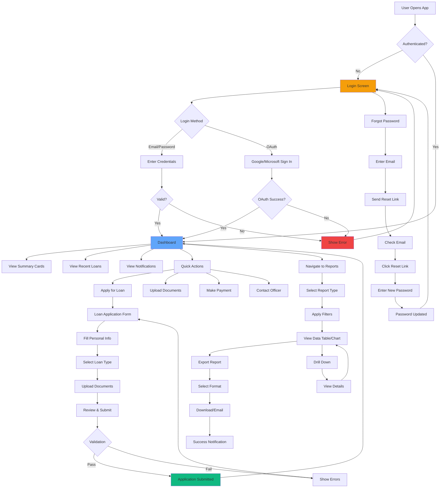
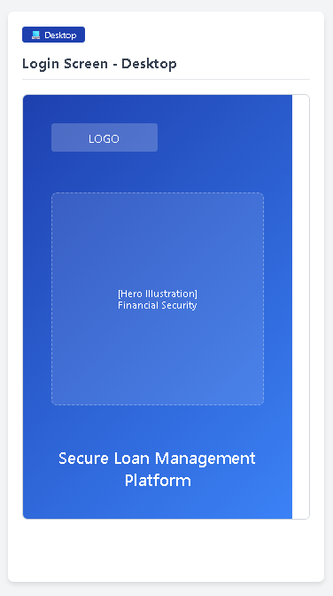
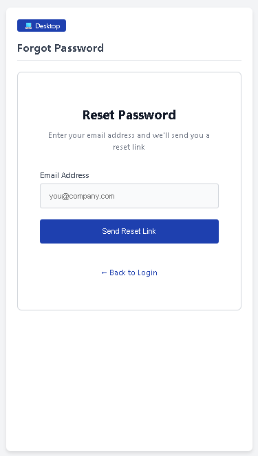
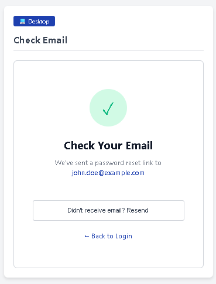
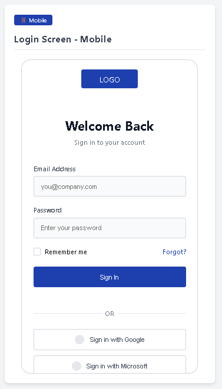
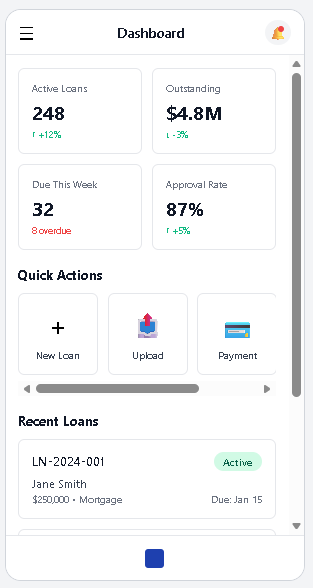
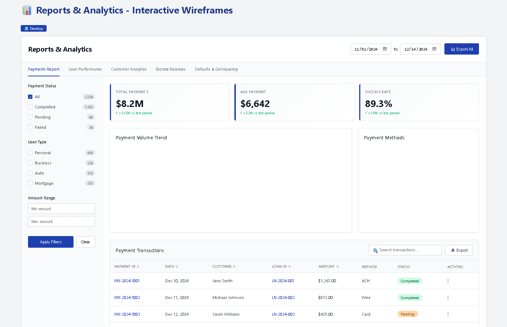

# Loan Search Application

A modern loan management system with an Angular frontend and Rust backend API, featuring advanced search capabilities and real-time data visualization.

## 🏗️ Architecture

```
┌─────────────────┐    ┌─────────────────┐    ┌─────────────────┐
│   Angular UI    │───▶│   Rust API      │───▶│   PostgreSQL    │
│   (Frontend)    │    │   (Backend)     │    │   (Database)    │
└─────────────────┘    └─────────────────┘    └─────────────────┘
```

### User Flow Diagram



## 🚀 Features
### Login & Authentication
- **Secure Login**: Email/password and OAuth 2.0 support
- **Password Recovery**: Email-based password reset flow
- **Session Management**: JWT-based authentication with refresh tokens
- **Role-Based Access Control**: Different access levels for users
- **Audit Logging**: Track login attempts and changes
- **Two-Factor Authentication (2FA)**: Optional 2FA via email or authenticator apps

 &nbsp; &nbsp;  <br/>
<br/>


### Frontend (Angular)
 <br/><br/>
 <br/>


- **Advanced Search Interface**: Multi-field search with real-time filtering
- **Responsive Design**: Mobile-first UI with modern styling
- **Real-time Updates**: Debounced search with instant results
- **Data Visualization**: Clean tabular display with status indicators
- **Export Capabilities**: CSV/Excel export functionality
- **Performance Optimized**: Lazy loading and pagination support

### Backend (Rust)
- **High-Performance API**: Built with Actix-web for maximum throughput
- **Advanced Filtering**: Complex query building with multiple criteria
- **Database Integration**: SQLx with PostgreSQL for type-safe queries
- **RESTful Design**: Clean API endpoints following REST principles
- **Error Handling**: Comprehensive error handling and logging
- **Health Checks**: Built-in health monitoring endpoints

### Database Schema
```sql
loans (
    loan_id VARCHAR(50) PRIMARY KEY,
    customer_name VARCHAR(255) NOT NULL,
    property_address TEXT NOT NULL,
    origination_date DATE NOT NULL,
    maturity_date DATE NOT NULL,
    loan_amount DECIMAL(15,2) NOT NULL,
    remaining_balance DECIMAL(15,2) NOT NULL,
    interest_rate DECIMAL(5,3) NOT NULL,
    monthly_payment DECIMAL(10,2) NOT NULL,
    status VARCHAR(50) NOT NULL,
    product_name VARCHAR(255) NOT NULL,
    product_type VARCHAR(100) NOT NULL,
    security_name VARCHAR(255) NOT NULL,
    servicer_name VARCHAR(255) NOT NULL,
    current_status VARCHAR(50) NOT NULL
)
```

## 🛠️ Technology Stack

| Component | Technology | Version |
|-----------|------------|---------|
| Frontend | Angular | 17.x |
| Backend | Rust | 1.75+ |
| Web Framework | Actix-web | 4.4 |
| Database | PostgreSQL | 15+ |
| ORM | SQLx | 0.7 |
| Containerization | Docker | Latest |

## 📋 Prerequisites
- **Node.js** 18+ and npm
- **Rust** 1.75+ with Cargo
- **PostgreSQL** 15+
- **Docker** & Docker Compose (optional)
- **Angular CLI** 17+

## 🚀 Quick Start

### Option 1: Docker Compose (Recommended)
### Option 2: Manual Setup
#### 1. Database Setup
#### 2. Backend Setup
#### 3. Frontend Setup

## 🔧 Configuration
### Environment Variables
#### Backend (.env)
#### Frontend (environment.ts)

## 📚 API Documentation
### Endpoints

| Method | Endpoint | Description | Parameters |
|--------|----------|-------------|------------|
| GET | `/api/loans/search` | Search loans | Query parameters |
| GET | `/api/loans/{id}` | Get loan by ID | Path parameter |
| GET | `/api/loans/statistics` | Get loan statistics | None |
| GET | `/health` | Health check | None |


## 🧪 Testing
### Backend Tests
### Frontend Tests
### Load Testing


## 📊 Performance Benchmarks

| Metric | Value | Notes |
|--------|--------|-------|
| Search Response Time | < 50ms | 10,000 records |
| Concurrent Users | 1000+ | Load tested |
| Database Queries | < 10ms | With proper indexing |
| Memory Usage | < 50MB | Rust backend |


## 🔐 Security Considerations

- **Input Validation**: All inputs are sanitized and validated
- **SQL Injection Prevention**: Using parameterized queries with SQLx
- **CORS Configuration**: Properly configured for production
- **Environment Variables**: Sensitive data stored in environment variables
- **Rate Limiting**: Consider implementing rate limiting for production

## 🚀 Deployment

### Production Deployment
### Environment-specific Configuration

- **Development**: `docker-compose.yml`
- **Staging**: `docker-compose.staging.yml`
- **Production**: `docker-compose.prod.yml`

## 👥 Team

- **Backend Development**: Rust/Actix-web Evangelist
- **Frontend Development**: Angular/TypeScript Evangelist
- **Database Design**: PostgreSQL Evangelist
- **DevOps**: Docker/Docker Compose Evangelist


